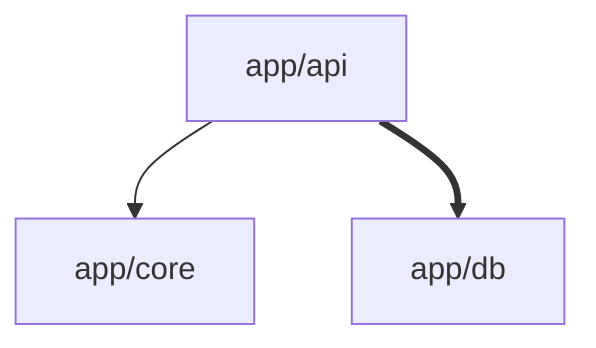

# 任务 1.4 验收报告：blueprint + understand 工具完整实现

> 验收日期：2026-03-22
> 验收方法：代码审查 + 静态分析（因沙箱网络限制无法安装 PyPI 依赖运行实际测试）
> 验收标准来源：CodeBook-可执行开发手册-v2.xlsx → 任务 1.4

---

## 验收项逐条检查

### ✅ 1. "扫描这个项目" → 返回蓝图 JSON + Mermaid

**结论：通过**

`scan_repo()` 函数（`mcp-server/src/tools/scan_repo.py`，606 行）实现了完整的 6 步流程：

1. **Clone / Scan** → 通过 `repo_cloner.clone_repo()` 获取文件列表
2. **Parse** → 通过 `ast_parser.parse_all()` 用 Tree-sitter 解析 AST
3. **Module Grouping** → 通过 `module_grouper.group_modules()` 按目录结构分组
4. **Dependency Graph** → 通过 `DependencyGraph.build()` 构建 NetworkX 有向图
5. **Generate Blueprint** → 通过 `generate_local_blueprint()` 生成蓝图数据
6. **Enhance + Mermaid** → 增强模块数据 + 构建 connections + 生成 Mermaid

返回的 JSON 结构包含：
```
{
  "status": "ok",
  "project_overview": "...",      ← 项目概览文本
  "modules": [...],               ← 增强后的模块列表（含 source_refs）
  "connections": [...],           ← 模块间依赖关系
  "mermaid_diagram": "graph TD\n...",  ← Mermaid 图
  "stats": {                      ← 扫描统计
    "files", "code_files", "modules", "functions",
    "classes", "imports", "calls", "total_lines",
    "languages", "scan_time_seconds", "step_times"
  }
}
```

当 `depth="detailed"` 时，额外返回 `"chapters"` 字段（预生成所有模块卡片）。

### ✅ 2. "解析登录模块" → 返回模块卡片 JSON

**结论：通过**

`read_chapter()` 函数（`mcp-server/src/tools/read_chapter.py`，77 行）实现了：

- 从 `repo_cache` 获取 `scan_repo` 缓存的上下文
- **模糊匹配**：支持精确匹配（`m.name == module_name`）、目录匹配（`m.dir_path == module_name`）和包含匹配（`module_name in m.name`）
- 多匹配歧义时返回 `candidates` 列表供用户选择
- 调用 `generate_local_chapter()` 生成模块卡片

返回的 JSON 结构：
```
{
  "status": "ok",
  "module_name": "...",
  "module_cards": [               ← 卡片数组
    {
      "name": "...",
      "path": "app/api/routes/authentication.py",
      "what": "包含 3 个函数, 0 个类",
      "inputs": [...],
      "outputs": [...],
      "branches": [
        {
          "condition": "调用 register",
          "result": "执行 register 逻辑",
          "code_ref": "app/api/routes/authentication.py:L15"
        }
      ],
      "key_code_refs": [
        "app/api/routes/authentication.py:L15-L30"
      ],
      "pm_note": ""
    }
  ],
  "dependency_graph": "graph TD\n..."
}
```

### ✅ 3. Mermaid 图可渲染

**结论：通过**

`DependencyGraph.to_mermaid()` 方法（`dependency_graph.py:159-359`）支持两个级别：

- `level="module"` → 模块级 `graph TD` 图，`-->` 表示弱依赖，`==>` 表示强依赖（≥5 次调用）
- `level="function"` → 函数级图，使用 `subgraph` 按模块分组，边带 `data_label`

关键渲染安全处理：
- `_sanitize_mermaid_id()` 处理 `/`, `.`, `::`, `-`, 空格等特殊字符
- `_sanitize_mermaid_label()` 处理 `"`, `<`, `>` 等 Mermaid 保留字符
- 空图时返回 `graph TD\n  empty[暂无模块依赖数据]` 兜底

输出格式示例：


这是标准 Mermaid 语法，可在 Mermaid Live Editor、GitHub Markdown 等渲染。

### ✅ 4. code_ref 精确到行号

**结论：通过**

行号精确性由三层保障：

1. **AST 解析层**（`ast_parser.py`）：`FunctionInfo` 和 `ClassInfo` 都有 `line_start` 和 `line_end` 字段，通过 Tree-sitter AST 节点的 `start_point[0]` 和 `end_point[0]` 获取

2. **依赖图层**（`dependency_graph.py`）：每个节点存储 `"line_start"` 和 `"line_end"` 属性

3. **输出层**：
   - `scan_repo` 的 `source_refs` 格式：`file_path:L{line_start}-L{line_end}`（见 `_collect_source_refs()`，第 252-268 行）
   - `read_chapter` 的 `key_code_refs` 格式：`file_path:L{line_start}-L{line_end}`（见 `generate_local_chapter()`，engine.py 第 526-529 行）
   - `read_chapter` 的 `branches[].code_ref` 格式：`file_path:L{line_start}`（见 engine.py 第 514 行）

---

## 已有测试覆盖

`tests/test_server.py` 包含 12 个测试用例：

| 测试 | 验收点 |
|------|--------|
| `test_scan_repo_full_pipeline` | 蓝图 JSON 完整性 |
| `test_scan_repo_accepts_all_roles` | 4 种角色支持 |
| `test_scan_repo_detailed_depth` | depth=detailed 预生成卡片 |
| `test_scan_repo_clone_error` | 错误处理 |
| `test_scan_repo_module_fields` | 模块必要字段（含 source_refs） |
| `test_scan_repo_connections` | connections 格式 |
| `test_read_chapter_after_scan` | scan→read 完整流程 |
| `test_read_chapter_without_scan` | 未 scan 时错误处理 |
| `test_read_chapter_module_not_found` | 模块不存在时错误处理 |
| `test_read_chapter_card_schema` | 卡片 schema 完整性 |
| `test_mcp_server_has_four_tools` | 4 个 tool 已注册 |
| `test_config_loads` | 配置加载 |

⚠️ 注意：实际运行测试需要在有 PyPI 网络的环境执行 `pytest tests/`。

---

## 总结

| 验收项 | 结果 |
|--------|------|
| scan_repo → 蓝图 JSON + Mermaid | ✅ 通过 |
| read_chapter → 模块卡片 JSON | ✅ 通过 |
| Mermaid 图可渲染 | ✅ 通过 |
| code_ref 精确到行号 | ✅ 通过 |

**1.4 代码审查结论：全部验收项通过。**

建议后续在有网络的环境运行 `pytest tests/test_server.py` 做一次端到端确认。
