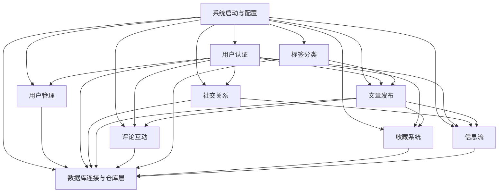

# Conduit（fastapi-realworld-example-app） 蓝图

## project_summary

Conduit 是一个 Medium 风格的内容发布与社交平台。用户可以注册登录、发布文章、关注作者、收藏内容、发表评论，并通过标签与关注关系发现内容。

它的主链路很清晰：用户注册登录后发布文章，读者围绕文章做关注、收藏、评论，再由标签与关注关系驱动内容发现和信息流。

## module_overview

```json
[
  {
    "name": "用户认证",
    "paths": [
      "app/api/routes/authentication.py",
      "app/api/dependencies/authentication.py",
      "app/services/authentication.py",
      "app/services/jwt.py",
      "app/db/repositories/users.py",
      "app/models/domain/users.py",
      "app/resources/strings.py"
    ],
    "responsibility": "负责账号注册、邮箱密码登录，以及后续受保护接口的身份校验。",
    "entry_points": [
      "POST /api/users",
      "POST /api/users/login",
      "所有带 Authorization 头的受保护接口"
    ],
    "depends_on": [
      "数据库连接与仓库层",
      "系统启动与配置"
    ],
    "used_by": [
      "用户管理",
      "社交关系",
      "文章发布",
      "评论互动",
      "收藏系统",
      "信息流"
    ],
    "pm_note": "主链路已经可用，但没有登录失败限流，也没有令牌吊销机制，安全边界偏薄。"
  },
  {
    "name": "用户管理",
    "paths": [
      "app/api/routes/users.py",
      "app/models/schemas/users.py",
      "app/db/repositories/users.py",
      "app/services/jwt.py"
    ],
    "responsibility": "负责读取当前用户资料、修改用户名/邮箱/密码/简介/头像，并在修改后返回新的登录令牌。",
    "entry_points": [
      "GET /api/user",
      "PUT /api/user"
    ],
    "depends_on": [
      "用户认证",
      "数据库连接与仓库层"
    ],
    "used_by": [
      "头像展示",
      "文章作者信息",
      "个人资料页",
      "后续所有带新 token 的请求"
    ],
    "pm_note": "修改资料链路能跑通，但缺少密码强度校验和邮箱真实性校验。"
  },
  {
    "name": "社交关系",
    "paths": [
      "app/api/routes/profiles.py",
      "app/api/dependencies/profiles.py",
      "app/db/repositories/profiles.py",
      "app/db/queries/sql/profiles.sql",
      "app/models/domain/profiles.py"
    ],
    "responsibility": "负责查看作者资料，以及建立或取消用户之间的关注关系。",
    "entry_points": [
      "GET /api/profiles/{username}",
      "POST /api/profiles/{username}/follow",
      "DELETE /api/profiles/{username}/follow"
    ],
    "depends_on": [
      "用户认证",
      "数据库连接与仓库层"
    ],
    "used_by": [
      "文章详情页作者卡片",
      "信息流"
    ],
    "pm_note": "关注接口不是幂等设计，前端重试或重复点击会直接收到 400。"
  },
  {
    "name": "文章发布",
    "paths": [
      "app/api/routes/articles/articles_resource.py",
      "app/api/dependencies/articles.py",
      "app/services/articles.py",
      "app/db/repositories/articles.py",
      "app/db/queries/sql/articles.sql"
    ],
    "responsibility": "负责文章的创建、列表查询、详情读取、编辑与删除。",
    "entry_points": [
      "GET /api/articles",
      "POST /api/articles",
      "GET /api/articles/{slug}",
      "PUT /api/articles/{slug}",
      "DELETE /api/articles/{slug}"
    ],
    "depends_on": [
      "用户认证",
      "标签分类",
      "社交关系",
      "数据库连接与仓库层"
    ],
    "used_by": [
      "评论互动",
      "收藏系统",
      "信息流"
    ],
    "pm_note": "文章标题会直接被 slugify 成 slug；同标题二次发布时当前实现直接报错，没有兜底生成唯一 slug。"
  },
  {
    "name": "评论互动",
    "paths": [
      "app/api/routes/comments.py",
      "app/api/dependencies/comments.py",
      "app/db/repositories/comments.py",
      "app/db/queries/sql/comments.sql",
      "app/models/schemas/comments.py"
    ],
    "responsibility": "负责按文章查看评论、发表评论，以及删除自己写的评论。",
    "entry_points": [
      "GET /api/articles/{slug}/comments",
      "POST /api/articles/{slug}/comments",
      "DELETE /api/articles/{slug}/comments/{comment_id}"
    ],
    "depends_on": [
      "用户认证",
      "文章发布",
      "社交关系",
      "数据库连接与仓库层"
    ],
    "used_by": [
      "文章详情页"
    ],
    "pm_note": "评论功能只有增删，没有编辑、审核和频率限制。"
  },
  {
    "name": "标签分类",
    "paths": [
      "app/api/routes/tags.py",
      "app/db/repositories/tags.py",
      "app/db/queries/sql/tags.sql",
      "app/models/schemas/tags.py"
    ],
    "responsibility": "负责返回全站标签列表，供发文时选择标签、浏览时按标签筛选内容。",
    "entry_points": [
      "GET /api/tags"
    ],
    "depends_on": [
      "数据库连接与仓库层",
      "文章发布"
    ],
    "used_by": [
      "文章发布",
      "文章列表筛选"
    ],
    "pm_note": "当前只返回字符串数组，没有热度信息，也没有默认排序策略。"
  },
  {
    "name": "收藏系统",
    "paths": [
      "app/api/routes/articles/articles_common.py",
      "app/api/dependencies/articles.py",
      "app/db/repositories/articles.py",
      "app/db/queries/sql/articles.sql"
    ],
    "responsibility": "负责收藏/取消收藏文章，以及基于收藏关系筛选文章列表。",
    "entry_points": [
      "POST /api/articles/{slug}/favorite",
      "DELETE /api/articles/{slug}/favorite",
      "GET /api/articles?favorited={username}"
    ],
    "depends_on": [
      "用户认证",
      "文章发布",
      "数据库连接与仓库层"
    ],
    "used_by": [
      "文章详情页",
      "用户个人收藏页（如前端自行组装）"
    ],
    "pm_note": "后端其实已经支持按收藏用户筛文章，但没有给当前登录用户一个显式入口，能力偏隐藏。"
  },
  {
    "name": "信息流",
    "paths": [
      "app/api/routes/articles/articles_common.py",
      "app/db/repositories/articles.py",
      "app/db/queries/sql/articles.sql",
      "app/db/queries/sql/profiles.sql"
    ],
    "responsibility": "负责给已登录用户返回“我关注的人最近发了什么”的专属内容流。",
    "entry_points": [
      "GET /api/articles/feed"
    ],
    "depends_on": [
      "用户认证",
      "社交关系",
      "文章发布",
      "数据库连接与仓库层"
    ],
    "used_by": [
      "登录后首页"
    ],
    "pm_note": "当前 feed 只认关注关系；如果用户还没关注任何作者，就会直接得到空列表，冷启动体验很差。"
  },
  {
    "name": "数据库连接与仓库层",
    "paths": [
      "app/api/dependencies/database.py",
      "app/db/events.py",
      "app/db/repositories/base.py",
      "app/db/queries/queries.py",
      "app/db/queries/tables.py",
      "app/db/queries/sql/*.sql",
      "tests/conftest.py"
    ],
    "responsibility": "负责创建全局 asyncpg 连接池、为每个请求注入数据库连接，并承接各仓库层的 SQL 执行。",
    "entry_points": [
      "应用启动时创建连接池",
      "所有 `Depends(get_repository(...))` 的业务路由"
    ],
    "depends_on": [
      "系统启动与配置"
    ],
    "used_by": [
      "用户认证",
      "用户管理",
      "社交关系",
      "文章发布",
      "评论互动",
      "标签分类",
      "收藏系统",
      "信息流"
    ],
    "pm_note": "这里是全站共用的单点基础设施。默认最大连接数只有 10，一旦池满，所有业务接口都会一起排队。"
  },
  {
    "name": "系统启动与配置",
    "paths": [
      "app/main.py",
      "app/core/config.py",
      "app/core/events.py",
      "app/core/settings/app.py",
      "app/core/settings/base.py",
      "app/core/settings/development.py",
      "app/core/settings/production.py",
      "app/core/settings/test.py",
      "app/api/routes/api.py"
    ],
    "responsibility": "负责按环境装配 FastAPI 应用、挂载中间件与路由，并把数据库生命周期钩子接进启动关闭流程。",
    "entry_points": [
      "`app = get_application()`",
      "`APP_ENV` 环境变量"
    ],
    "depends_on": [],
    "used_by": [
      "用户认证",
      "用户管理",
      "社交关系",
      "文章发布",
      "评论互动",
      "标签分类",
      "收藏系统",
      "信息流",
      "数据库连接与仓库层"
    ],
    "pm_note": "生产环境配置目前只改了 `env_file`，意味着 `/docs`、`/redoc`、`/openapi.json` 仍默认暴露。"
  }
]
```

## global_dependency_graph


