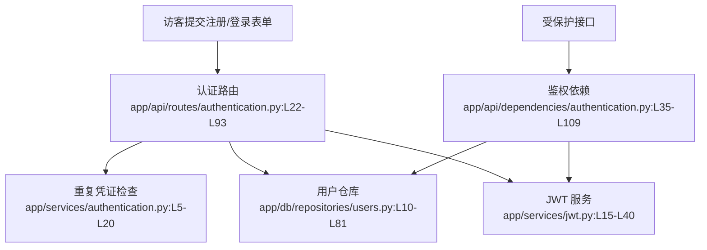

# 用户认证 · 看懂

> 分析范围
- app/api/routes/authentication.py
- app/api/dependencies/authentication.py
- app/services/authentication.py
- app/services/jwt.py
- app/db/repositories/users.py
- app/models/domain/users.py
- app/resources/strings.py

## module_cards

```json
[
  {
    "name": "用户认证",
    "path": "app/api/routes/authentication.py",
    "what": "访客提交注册或登录表单后，系统验证账号信息并返回后续请求可复用的 JWT 令牌。",
    "inputs": [
      "注册表单 `user.email / user.username / user.password`（来自访客）",
      "登录表单 `user.email / user.password`（来自已注册用户）",
      "Authorization 请求头（来自后续所有受保护请求）",
      "系统密钥与令牌前缀（来自配置）"
    ],
    "outputs": [
      "注册成功后的用户资料与登录令牌",
      "登录成功后的用户资料与登录令牌",
      "鉴权成功后注入到路由中的当前用户对象",
      "失败时的 400/403 错误响应"
    ],
    "branches": [
      {
        "condition": "注册时用户名已存在",
        "result": "直接返回 400 和 `USERNAME_TAKEN`，不创建账号。",
        "code_ref": "app/api/routes/authentication.py:L67-L71"
      },
      {
        "condition": "注册时邮箱已存在",
        "result": "直接返回 400 和 `EMAIL_TAKEN`，不创建账号。",
        "code_ref": "app/api/routes/authentication.py:L73-L77"
      },
      {
        "condition": "登录时邮箱不存在或密码不匹配",
        "result": "统一返回 400 和 `INCORRECT_LOGIN_INPUT`，避免暴露账号是否存在。",
        "code_ref": "app/api/routes/authentication.py:L28-L39"
      },
      {
        "condition": "受保护请求的 token 格式错误、签名错误或用户不存在",
        "result": "统一返回 403 和 `MALFORMED_PAYLOAD`。",
        "code_ref": "app/api/dependencies/authentication.py:L46-L109"
      }
    ],
    "side_effects": [
      "注册会向 `users` 表写入新账号，并同时写入新的 salt 与加密密码。证据：`app/db/repositories/users.py:L29-L48`。",
      "注册和登录都会签发 7 天有效的 JWT。证据：`app/services/jwt.py:L12-L32`。",
      "后续受保护请求会从 token 反解出用户名，再回库查一次用户。证据：`app/api/dependencies/authentication.py:L78-L100`。"
    ],
    "blast_radius": [
      "任何依赖 `get_current_user_authorizer()` 的接口都会被影响，包括资料修改、关注、发文、评论、收藏和信息流。",
      "登录文案或错误格式变化会直接影响前端表单提示与相关 API 测试。"
    ],
    "key_code_refs": [
      "app/api/routes/authentication.py:L22-L93",
      "app/api/dependencies/authentication.py:L35-L109",
      "app/services/authentication.py:L5-L20",
      "app/services/jwt.py:L15-L40",
      "app/db/repositories/users.py:L29-L81",
      "app/models/domain/users.py:L15-L24",
      "app/resources/strings.py:L3-L25"
    ],
    "pm_note": "当前错误表达偏技术化，且没有任何登录限流或设备级撤销机制，后续产品化时需要优先补。"
  }
]
```

## dependency_graph


