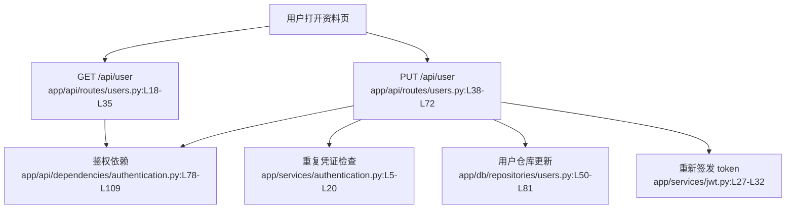

# 用户管理 · 看懂

> 分析范围
- app/api/routes/users.py
- app/models/schemas/users.py
- app/db/repositories/users.py
- app/services/jwt.py

## module_cards

```json
[
  {
    "name": "用户管理",
    "path": "app/api/routes/users.py",
    "what": "已登录用户进入个人设置后，系统允许他查看或修改自己的公开资料与密码。",
    "inputs": [
      "Authorization 请求头（来自已登录用户）",
      "资料更新体 `user.username / email / password / bio / image`（来自设置页）"
    ],
    "outputs": [
      "当前用户资料",
      "修改成功后的最新用户资料与新 token",
      "用户名/邮箱冲突时的 400 错误"
    ],
    "branches": [
      {
        "condition": "用户修改成已被占用的用户名",
        "result": "返回 400 和 `USERNAME_TAKEN`，不落库。",
        "code_ref": "app/api/routes/users.py:L45-L50"
      },
      {
        "condition": "用户修改成已被占用的邮箱",
        "result": "返回 400 和 `EMAIL_TAKEN`，不落库。",
        "code_ref": "app/api/routes/users.py:L52-L57"
      },
      {
        "condition": "用户提交了新密码",
        "result": "仓库层会重新生成 salt 并重算哈希密码。",
        "code_ref": "app/db/repositories/users.py:L66-L79"
      },
      {
        "condition": "请求没有合法 token",
        "result": "鉴权依赖直接返回 403，请求进不到资料路由。",
        "code_ref": "app/api/dependencies/authentication.py:L46-L109"
      }
    ],
    "side_effects": [
      "修改资料会更新 `users` 表，并覆盖 username/email/bio/image 或密码哈希。证据：`app/db/repositories/users.py:L50-L81`。",
      "资料读写完成后，会重新签发一个新 token。证据：`app/api/routes/users.py:L59-L72`。"
    ],
    "blast_radius": [
      "用户名和头像变化会影响文章作者展示、评论作者展示以及 profile 页面。",
      "密码修改策略会直接影响登录成功率与账号安全性。"
    ],
    "key_code_refs": [
      "app/api/routes/users.py:L18-L72",
      "app/models/schemas/users.py:L18-L31",
      "app/db/repositories/users.py:L50-L81",
      "app/services/jwt.py:L27-L40"
    ],
    "pm_note": "密码字段在更新场景里没有最小长度约束，意味着弱密码可以直接生效。"
  }
]
```

## dependency_graph


