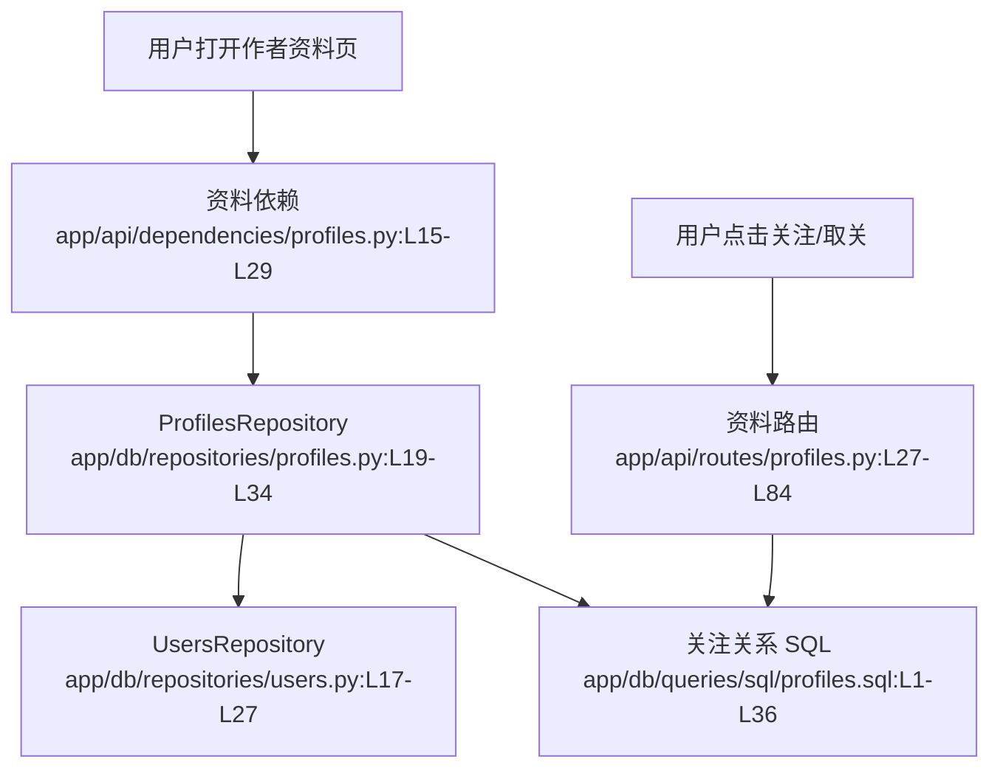

# 社交关系 · 看懂

> 分析范围
- app/api/routes/profiles.py
- app/api/dependencies/profiles.py
- app/db/repositories/profiles.py
- app/db/queries/sql/profiles.sql
- app/models/domain/profiles.py

## module_cards

```json
[
  {
    "name": "社交关系",
    "path": "app/api/routes/profiles.py",
    "what": "用户查看某个作者主页时，系统需要告诉他对方资料以及当前是否已关注；点击关注按钮时则写入关注关系。",
    "inputs": [
      "路径参数 `username`（来自作者资料页或文章作者卡片）",
      "Authorization 请求头（来自已登录用户的关注/取关操作）"
    ],
    "outputs": [
      "作者资料对象 `profile`",
      "关注或取关后的最新 `following` 状态",
      "自关注、重复关注、重复取关等异常时的 400 错误"
    ],
    "branches": [
      {
        "condition": "查询的用户名不存在",
        "result": "依赖层直接返回 404 和 `USER_DOES_NOT_EXIST_ERROR`。",
        "code_ref": "app/api/dependencies/profiles.py:L15-L29"
      },
      {
        "condition": "用户试图关注自己",
        "result": "返回 400 和 `UNABLE_TO_FOLLOW_YOURSELF`。",
        "code_ref": "app/api/routes/profiles.py:L37-L41"
      },
      {
        "condition": "用户重复点击关注",
        "result": "返回 400 和 `USER_IS_ALREADY_FOLLOWED`。",
        "code_ref": "app/api/routes/profiles.py:L43-L47"
      },
      {
        "condition": "用户重复点击取关",
        "result": "返回 400 和 `USER_IS_NOT_FOLLOWED`。",
        "code_ref": "app/api/routes/profiles.py:L73-L77"
      }
    ],
    "side_effects": [
      "关注成功会向 `followers_to_followings` 表插入一条关系记录。证据：`app/db/repositories/profiles.py:L50-L61`。",
      "取关成功会删除对应关系记录。证据：`app/db/repositories/profiles.py:L63-L74`。"
    ],
    "blast_radius": [
      "关注关系变化会直接影响 feed 内容是否出现某位作者的文章。",
      "作者资料接口的 `following` 状态会影响文章详情页和 profile 页按钮文案。"
    ],
    "key_code_refs": [
      "app/api/routes/profiles.py:L16-L84",
      "app/api/dependencies/profiles.py:L15-L29",
      "app/db/repositories/profiles.py:L19-L74",
      "app/db/queries/sql/profiles.sql:L1-L36"
    ],
    "pm_note": "接口已经保护了“不能关注自己”，但对重复请求的处理偏硬，前端重试体验不好。"
  }
]
```

## dependency_graph


