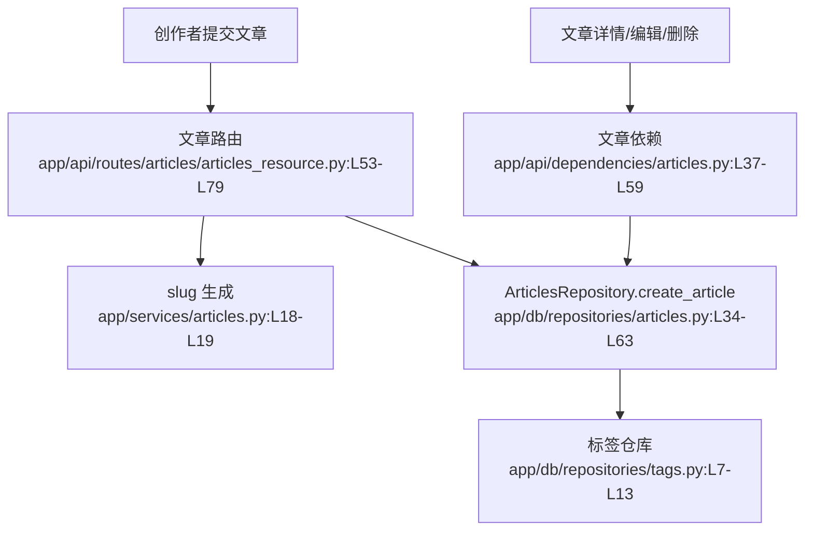

# 文章发布 · 看懂

> 分析范围
- app/api/routes/articles/articles_resource.py
- app/api/dependencies/articles.py
- app/services/articles.py
- app/db/repositories/articles.py
- app/db/queries/sql/articles.sql

## module_cards

```json
[
  {
    "name": "文章发布",
    "path": "app/api/routes/articles/articles_resource.py",
    "what": "创作者发布文章时，系统负责生成 slug、写入正文与标签，并在后续支持列表、详情、编辑、删除等主流程。",
    "inputs": [
      "文章发布体 `title / description / body / tagList`（来自编辑器）",
      "可选查询参数 `tag / author / favorited / limit / offset`（来自列表页）",
      "路径参数 `slug`（来自文章详情和编辑页）"
    ],
    "outputs": [
      "文章详情对象或文章列表",
      "创建成功后的文章 slug",
      "作者无权限或文章不存在时的 403/404"
    ],
    "branches": [
      {
        "condition": "创建文章时 slug 已存在",
        "result": "直接返回 400 和 `ARTICLE_ALREADY_EXISTS`。",
        "code_ref": "app/api/routes/articles/articles_resource.py:L64-L69"
      },
      {
        "condition": "用户编辑或删除不是自己写的文章",
        "result": "权限依赖直接返回 403。",
        "code_ref": "app/api/dependencies/articles.py:L51-L59"
      },
      {
        "condition": "文章带有新标签",
        "result": "先补建不存在的标签，再建立文章和标签的关联关系。",
        "code_ref": "app/db/repositories/articles.py:L44-L57"
      },
      {
        "condition": "文章 slug 在库里不存在",
        "result": "读取依赖返回 404 和 `ARTICLE_DOES_NOT_EXIST_ERROR`。",
        "code_ref": "app/api/dependencies/articles.py:L37-L48"
      }
    ],
    "side_effects": [
      "创建文章会写入 `articles` 表，并可能顺带创建 `tags` 与 `articles_to_tags` 关系。证据：`app/db/repositories/articles.py:L34-L63`。",
      "删除文章会从 `articles` 表移除记录。证据：`app/db/repositories/articles.py:L93-L100`。",
      "列表和详情查询会额外补出作者资料、标签列表与收藏数。证据：`app/db/repositories/articles.py:L294-L330`。"
    ],
    "blast_radius": [
      "slug 生成规则变化会影响文章详情页 URL、评论路径、收藏路径与 feed 中的文章链接。",
      "标签写入规则变化会影响标签页与文章详情的 tagList。"
    ],
    "key_code_refs": [
      "app/api/routes/articles/articles_resource.py:L30-L120",
      "app/api/dependencies/articles.py:L21-L59",
      "app/services/articles.py:L9-L23",
      "app/db/repositories/articles.py:L34-L330",
      "app/db/queries/sql/articles.sql:L37-L116"
    ],
    "pm_note": "创建链路很直接，但 slug 冲突的处理还是“拒绝用户”，不是“帮用户自动化兜底”。"
  }
]
```

## dependency_graph


