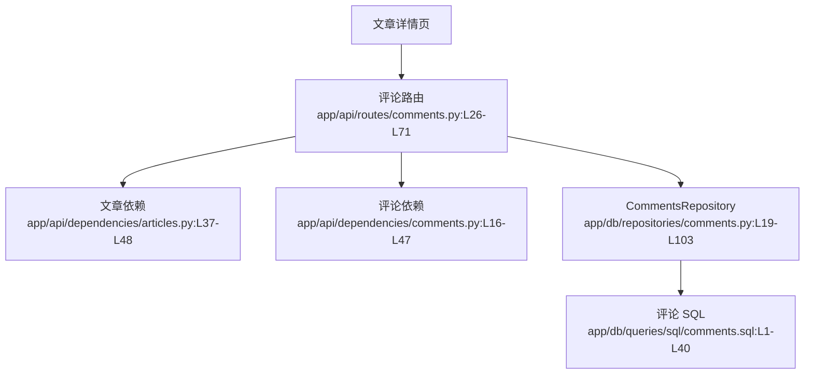

# 评论互动 · 看懂

> 分析范围
- app/api/routes/comments.py
- app/api/dependencies/comments.py
- app/db/repositories/comments.py
- app/db/queries/sql/comments.sql
- app/models/schemas/comments.py

## module_cards

```json
[
  {
    "name": "评论互动",
    "path": "app/api/routes/comments.py",
    "what": "读者进入文章详情页后，可以查看评论并发表新评论；作者本人也可以删除自己的评论。",
    "inputs": [
      "路径参数 `slug` 与 `comment_id`（来自文章详情页）",
      "评论创建体 `comment.body`（来自评论输入框）",
      "Authorization 请求头（来自已登录用户）"
    ],
    "outputs": [
      "评论列表",
      "新创建的评论对象",
      "删除成功后的 204 响应",
      "无权限或评论不存在时的 403/404"
    ],
    "branches": [
      {
        "condition": "文章不存在",
        "result": "评论路由依赖先返回 404，后续评论逻辑不会执行。",
        "code_ref": "app/api/dependencies/articles.py:L37-L48"
      },
      {
        "condition": "用户新增评论",
        "result": "向 `commentaries` 表插入一条记录，并回填作者资料。",
        "code_ref": "app/db/repositories/comments.py:L61-L78"
      },
      {
        "condition": "用户尝试删除别人的评论",
        "result": "评论权限依赖返回 403。",
        "code_ref": "app/api/dependencies/comments.py:L39-L47"
      },
      {
        "condition": "评论 id 不存在",
        "result": "评论依赖返回 404 和 `COMMENT_DOES_NOT_EXIST`。",
        "code_ref": "app/api/dependencies/comments.py:L16-L36"
      }
    ],
    "side_effects": [
      "新增评论会向 `commentaries` 表写入记录。证据：`app/db/queries/sql/comments.sql:L20-L34`。",
      "删除评论会真正从表中移除对应数据。证据：`app/db/queries/sql/comments.sql:L36-L40`。"
    ],
    "blast_radius": [
      "评论删除权限变化会影响文章详情页的操作按钮展示。",
      "评论模型变化会影响文章详情的评论列表结构。"
    ],
    "key_code_refs": [
      "app/api/routes/comments.py:L26-L71",
      "app/api/dependencies/comments.py:L16-L47",
      "app/db/repositories/comments.py:L19-L103",
      "app/db/queries/sql/comments.sql:L1-L40",
      "app/models/schemas/comments.py:L7-L16"
    ],
    "pm_note": "评论从产品角度还停留在“留言板 1.0”，没有编辑、审核和回复树结构。"
  }
]
```

## dependency_graph


