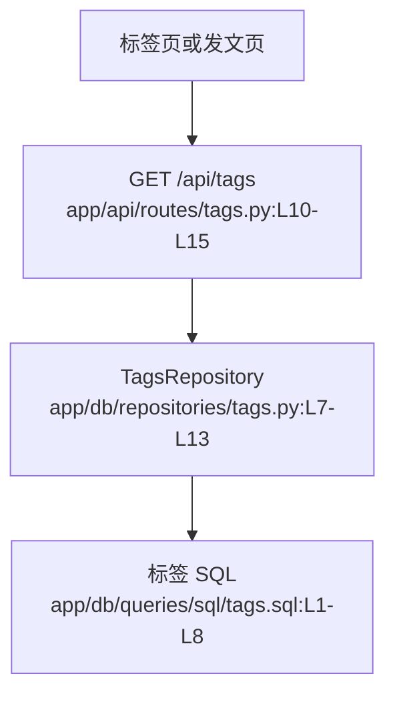

# 标签分类 · 看懂

> 分析范围
- app/api/routes/tags.py
- app/db/repositories/tags.py
- app/db/queries/sql/tags.sql
- app/models/schemas/tags.py

## module_cards

```json
[
  {
    "name": "标签分类",
    "path": "app/api/routes/tags.py",
    "what": "系统把所有已存在的标签收集起来，供用户发文时复用，或供首页做标签发现。",
    "inputs": [
      "无请求体；只依赖数据库中的标签表。"
    ],
    "outputs": [
      "标签字符串数组 `tags`",
      "没有标签时返回空列表"
    ],
    "branches": [
      {
        "condition": "库里还没有任何标签",
        "result": "返回空数组。",
        "code_ref": "tests/test_api/test_routes/test_tags.py:L11-L13"
      },
      {
        "condition": "文章创建时带入了新标签",
        "result": "不存在的标签会被自动插入 `tags` 表，重复值依赖 SQL 去重。",
        "code_ref": "app/db/repositories/tags.py:L12-L13"
      },
      {
        "condition": "请求获取标签列表",
        "result": "直接 `SELECT tag FROM tags`，不附带热度或排序信息。",
        "code_ref": "app/db/queries/sql/tags.sql:L1-L3"
      }
    ],
    "side_effects": [
      "标签接口本身只读，但文章发布会调用标签仓库补建缺失标签。证据：`app/db/repositories/tags.py:L12-L13`。"
    ],
    "blast_radius": [
      "标签返回结构变化会影响发文页标签选择器与首页标签推荐区。",
      "标签排序策略会影响用户首先看到哪些话题。"
    ],
    "key_code_refs": [
      "app/api/routes/tags.py:L10-L15",
      "app/db/repositories/tags.py:L7-L13",
      "app/db/queries/sql/tags.sql:L1-L8",
      "app/models/schemas/tags.py:L1-L7"
    ],
    "pm_note": "这个模块更像“标签字典服务”，不是“热门话题引擎”，所以天然缺少热度感知。"
  }
]
```

## dependency_graph


