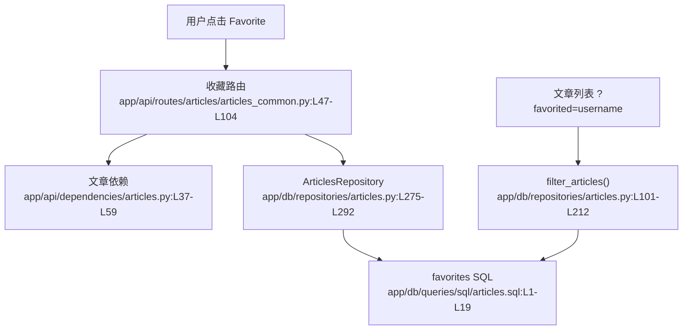

# 收藏系统 · 看懂

> 分析范围
- app/api/routes/articles/articles_common.py
- app/api/dependencies/articles.py
- app/db/repositories/articles.py
- app/db/queries/sql/articles.sql

## module_cards

```json
[
  {
    "name": "收藏系统",
    "path": "app/api/routes/articles/articles_common.py",
    "what": "用户在文章详情页点击心形按钮后，系统会写入收藏关系，并在文章列表中反映收藏状态与收藏数。",
    "inputs": [
      "路径参数 `slug`（来自文章详情）",
      "可选查询参数 `favorited=username`（来自文章列表筛选）",
      "Authorization 请求头（来自已登录用户）"
    ],
    "outputs": [
      "更新后的文章收藏状态与收藏数",
      "按收藏关系筛出的文章列表",
      "重复收藏或重复取消收藏时的 400 错误"
    ],
    "branches": [
      {
        "condition": "文章尚未被当前用户收藏",
        "result": "写入 `favorites` 表并把 `favorited` 改成 `true`。",
        "code_ref": "app/api/routes/articles/articles_common.py:L52-L69"
      },
      {
        "condition": "文章已被当前用户收藏后再次收藏",
        "result": "直接返回 400 和 `ARTICLE_IS_ALREADY_FAVORITED`。",
        "code_ref": "app/api/routes/articles/articles_common.py:L71-L74"
      },
      {
        "condition": "文章已被收藏后取消收藏",
        "result": "删除 `favorites` 关系并把计数减一。",
        "code_ref": "app/api/routes/articles/articles_common.py:L82-L99"
      },
      {
        "condition": "列表请求带 `favorited` 参数",
        "result": "仓库层通过 `favorites` 表关联筛出对应用户收藏过的文章。",
        "code_ref": "app/db/repositories/articles.py:L177-L212"
      }
    ],
    "side_effects": [
      "收藏和取消收藏都会改写 `favorites` 关系表。证据：`app/db/queries/sql/articles.sql:L1-L19`。",
      "读取文章详情或列表时，系统会额外查一次当前用户是否已收藏。证据：`app/db/repositories/articles.py:L266-L323`。"
    ],
    "blast_radius": [
      "收藏关系变化会影响文章详情页的心形按钮与收藏数。",
      "列表筛选规则变化会影响用户个人页、文章流与潜在的“我的收藏”页面。"
    ],
    "key_code_refs": [
      "app/api/routes/articles/articles_common.py:L47-L104",
      "app/db/repositories/articles.py:L101-L323",
      "app/db/queries/sql/articles.sql:L1-L25"
    ],
    "pm_note": "收藏并不是“没有入口”，而是“入口不够产品化”：当前只有底层 query 参数，没有面向当前用户的直接 API。"
  }
]
```

## dependency_graph


