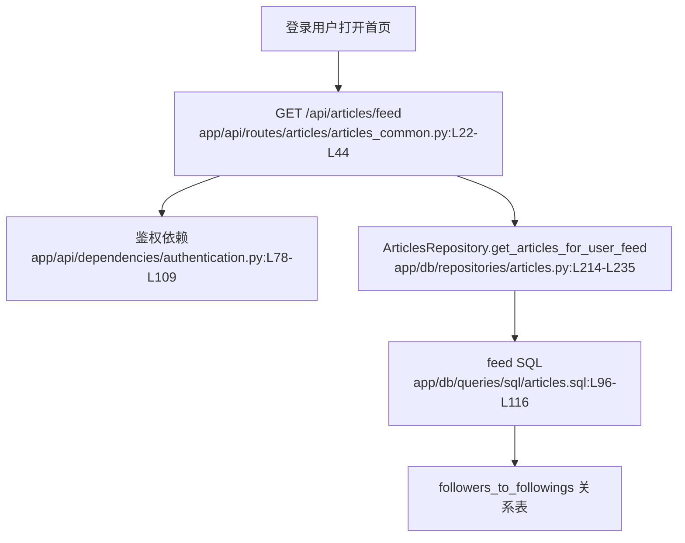

# 信息流 · 看懂

> 分析范围
- app/api/routes/articles/articles_common.py
- app/db/repositories/articles.py
- app/db/queries/sql/articles.sql
- app/db/queries/sql/profiles.sql

## module_cards

```json
[
  {
    "name": "信息流",
    "path": "app/api/routes/articles/articles_common.py",
    "what": "已登录用户打开首页时，系统根据他的关注关系，筛出被关注作者发布的文章并返回分页结果。",
    "inputs": [
      "Authorization 请求头（来自已登录用户）",
      "分页参数 `limit / offset`（来自首页滚动加载）"
    ],
    "outputs": [
      "只包含被关注作者文章的 feed 列表",
      "关注为空时的空列表"
    ],
    "branches": [
      {
        "condition": "请求没有合法 token",
        "result": "鉴权依赖直接返回 403。",
        "code_ref": "app/api/dependencies/authentication.py:L46-L109"
      },
      {
        "condition": "用户没有关注任何作者",
        "result": "feed SQL 关联不到任何记录，返回空数组。",
        "code_ref": "app/db/queries/sql/articles.sql:L96-L116"
      },
      {
        "condition": "用户已关注部分作者",
        "result": "只返回这些作者的文章，不包含其他人的内容。",
        "code_ref": "app/db/repositories/articles.py:L214-L235"
      }
    ],
    "side_effects": [
      "feed 自身不写库，但它强依赖关注关系表和文章表的一致性。"
    ],
    "blast_radius": [
      "关注规则、文章发布时间排序或分页策略变化都会直接影响登录后首页。",
      "feed 冷启动策略会直接影响新用户首次留存。"
    ],
    "key_code_refs": [
      "app/api/routes/articles/articles_common.py:L22-L44",
      "app/db/repositories/articles.py:L214-L235",
      "app/db/queries/sql/articles.sql:L96-L116",
      "tests/test_api/test_routes/test_articles.py:L246-L322"
    ],
    "pm_note": "这是一个非常“纯关注驱动”的 feed，没有推荐兜底，所以越早关注作者，体验越好；反之就是冷启动空白。"
  }
]
```

## dependency_graph


