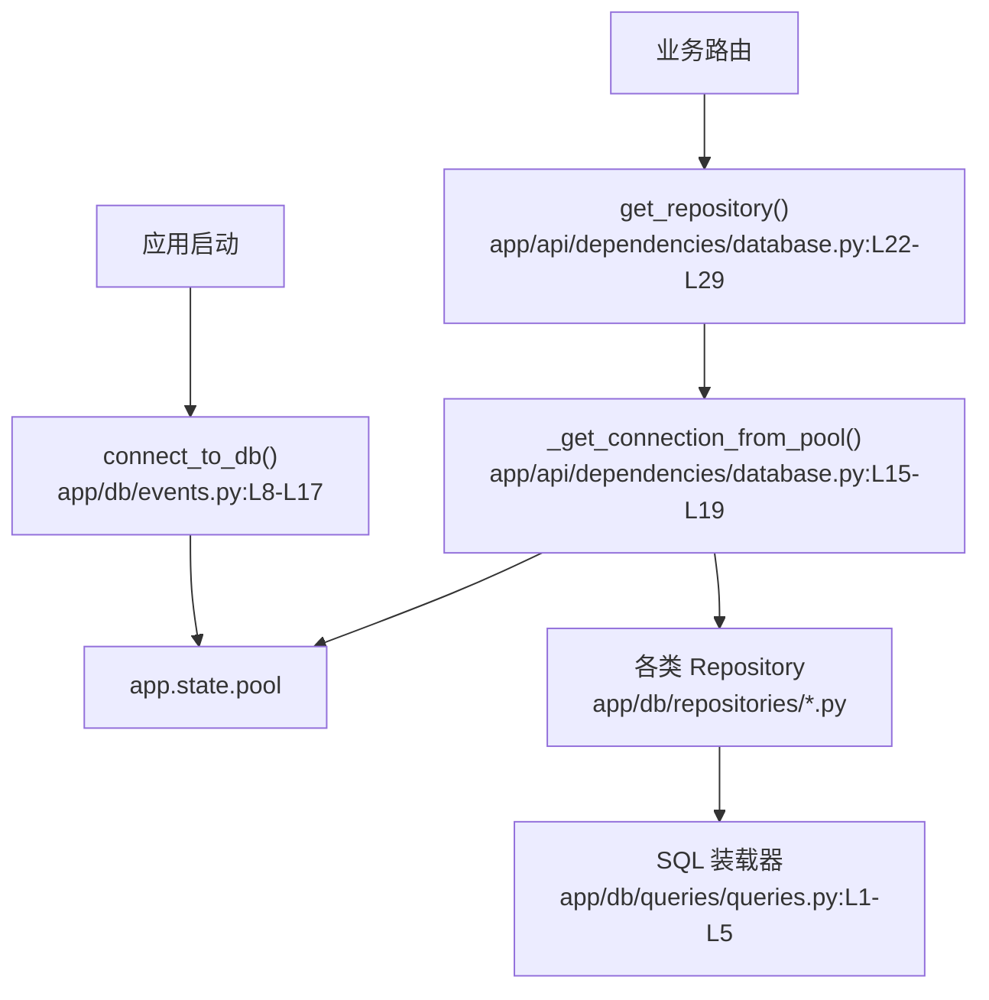

# 数据库连接与仓库层 · 看懂

> 分析范围
- app/api/dependencies/database.py
- app/db/events.py
- app/db/repositories/base.py
- app/db/queries/queries.py
- app/db/queries/tables.py
- app/db/queries/sql/*.sql
- tests/conftest.py

## module_cards

```json
[
  {
    "name": "数据库连接与仓库层",
    "path": "app/api/dependencies/database.py",
    "what": "应用启动时系统先建立一个共享连接池；后续每个请求通过依赖注入从池里借一条连接，仓库层再用这条连接执行 SQL。",
    "inputs": [
      "数据库连接串与连接池大小（来自配置）",
      "每个请求注入的 `Request` 对象与连接池状态"
    ],
    "outputs": [
      "可供仓库层复用的数据库连接",
      "启动时挂在 `app.state.pool` 上的全局连接池"
    ],
    "branches": [
      {
        "condition": "应用启动",
        "result": "创建 asyncpg 连接池并挂到 `app.state.pool`。",
        "code_ref": "app/db/events.py:L8-L17"
      },
      {
        "condition": "业务请求进入仓库依赖",
        "result": "从共享池里 `acquire()` 一条连接并在请求结束后归还。",
        "code_ref": "app/api/dependencies/database.py:L15-L29"
      },
      {
        "condition": "应用关闭",
        "result": "统一关闭连接池，释放数据库资源。",
        "code_ref": "app/db/events.py:L20-L25"
      }
    ],
    "side_effects": [
      "连接池大小会直接限制全站并发请求可同时访问数据库的数量。",
      "测试环境会在生命周期里把真实池替换成 `FakeAsyncPGPool`，以便集成测试。证据：`tests/conftest.py:L27-L35`。"
    ],
    "blast_radius": [
      "任何连接池配置调整都会影响所有模块，而不是单个接口。",
      "仓库注入方式变化会影响全站依赖写法与测试夹具。"
    ],
    "key_code_refs": [
      "app/api/dependencies/database.py:L11-L29",
      "app/db/events.py:L8-L25",
      "app/db/repositories/base.py:L4-L10",
      "app/db/queries/queries.py:L1-L5",
      "app/db/queries/tables.py:L7-L75",
      "tests/conftest.py:L19-L35"
    ],
    "pm_note": "这层不是一个“功能页”，而是所有功能页共享的高速公路收费站；收费站堵了，整站都会慢。"
  }
]
```

## dependency_graph


