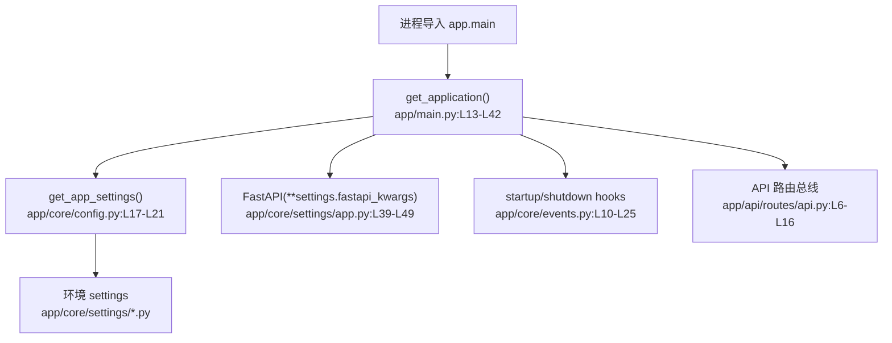

# 系统启动与配置 · 看懂

> 分析范围
- app/main.py
- app/core/config.py
- app/core/events.py
- app/core/settings/app.py
- app/core/settings/base.py
- app/core/settings/development.py
- app/core/settings/production.py
- app/core/settings/test.py
- app/api/routes/api.py

## module_cards

```json
[
  {
    "name": "系统启动与配置",
    "path": "app/main.py",
    "what": "应用进程启动后，系统先读环境配置，再创建 FastAPI 实例、挂载中间件、注册路由，并串起数据库启动/关闭钩子。",
    "inputs": [
      "`APP_ENV` 环境变量",
      "各环境 settings 类上的字段值"
    ],
    "outputs": [
      "已经装配完毕的 FastAPI 应用对象",
      "按环境定制的 docs / openapi / 数据库连接池配置"
    ],
    "branches": [
      {
        "condition": "APP_ENV=dev / prod / test",
        "result": "通过 `get_app_settings()` 选择对应的 settings 类。",
        "code_ref": "app/core/config.py:L10-L21"
      },
      {
        "condition": "应用启动",
        "result": "挂上 startup/shutdown 事件处理器，并注册 API 路由。",
        "code_ref": "app/main.py:L13-L42"
      },
      {
        "condition": "生产环境没有显式覆盖 docs 配置",
        "result": "FastAPI 会继续沿用 `AppSettings` 中默认开放的 docs/redoc/openapi。",
        "code_ref": "app/core/settings/app.py:L13-L18"
      }
    ],
    "side_effects": [
      "启动时会配置 logging、中间件、异常处理器和 API 路由前缀。",
      "生命周期钩子会进一步触发数据库连接池的建立与关闭。"
    ],
    "blast_radius": [
      "任何 settings 变更都会影响全站行为，而不是单一业务模块。",
      "docs/openapi 的暴露策略会直接影响对外可见面和安全基线。"
    ],
    "key_code_refs": [
      "app/main.py:L13-L45",
      "app/core/config.py:L10-L21",
      "app/core/events.py:L10-L25",
      "app/core/settings/app.py:L12-L57",
      "app/core/settings/production.py:L1-L6",
      "app/api/routes/api.py:L6-L16"
    ],
    "pm_note": "这是全站装配层，最容易被忽略的问题不是“功能坏了”，而是“生产环境默认值没有被收紧”。"
  }
]
```

## dependency_graph


