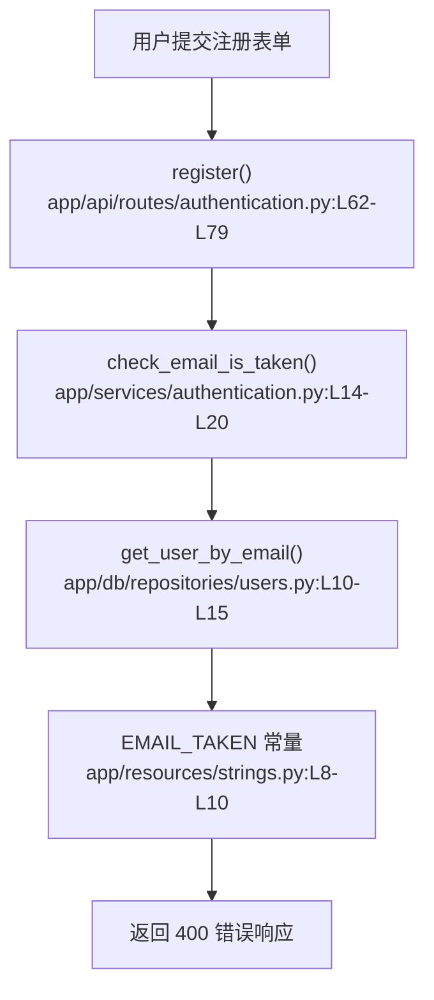

# 用户认证 · 定位

> 模拟问题：用户注册时填了已存在邮箱，为什么看到的是生硬英文报错？

## matched_modules

- 用户认证：注册接口直接决定返回什么错误结构和错误文案。
- 数据库连接与仓库层：邮箱是否已存在最终由 `users` 仓库查库决定。

## call_chain



## exact_locations

```json
[
  {
    "file": "app/api/routes/authentication.py",
    "line": 73,
    "why_it_matters": "邮箱命中重复检查后，注册路由在这里直接把 `strings.EMAIL_TAKEN` 放进错误响应。",
    "confidence": 0.99
  },
  {
    "file": "app/services/authentication.py",
    "line": 14,
    "why_it_matters": "这里只负责判断邮箱是否存在，不负责文案表达，所以真正的问题不在这里。",
    "confidence": 0.93
  },
  {
    "file": "app/resources/strings.py",
    "line": 10,
    "why_it_matters": "这里定义了用户最终看到的英文提示文本。",
    "confidence": 0.98
  }
]
```

## diagnosis

相关模块是用户认证。当前链路本身没有判错：注册接口先查邮箱，命中后正常返回 400。真正导致“像系统报错”的原因，是错误文本直接取自 `app/resources/strings.py:L10`，内容仍是后端内部表达。开发者应该优先打开 `app/api/routes/authentication.py:L73-L76` 和 `app/resources/strings.py:L8-L10`。
