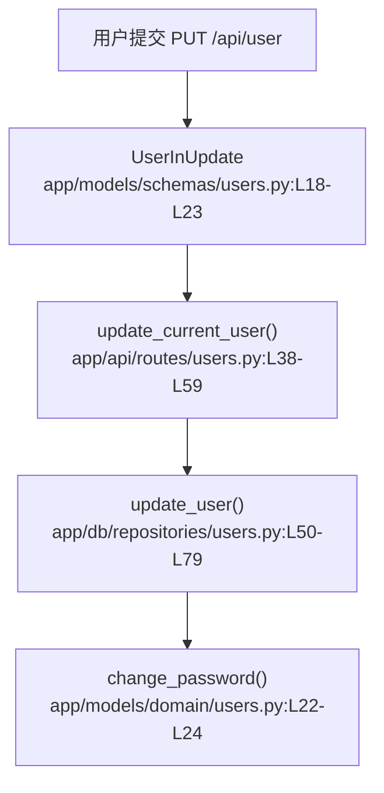

# 用户管理 · 定位

> 模拟问题：为什么用户可以把密码改成非常短的值？

## matched_modules

- 用户管理：密码更新请求的 schema 和路由都在这里。
- 用户认证：真正写入的新密码会继续影响后续登录行为。

## call_chain



## exact_locations

```json
[
  {
    "file": "app/models/schemas/users.py",
    "line": 21,
    "why_it_matters": "更新场景的密码字段是 `Optional[str]`，没有任何 `min_length` 或复杂度约束。",
    "confidence": 0.99
  },
  {
    "file": "app/api/routes/users.py",
    "line": 59,
    "why_it_matters": "路由拿到请求体后会直接把密码透传给仓库层，没有额外业务校验。",
    "confidence": 0.95
  },
  {
    "file": "app/db/repositories/users.py",
    "line": 66,
    "why_it_matters": "只要 `password` 非空，这里就会立即重算哈希并落库。",
    "confidence": 0.97
  }
]
```

## diagnosis

相关模块是用户管理。当前逻辑对密码更新几乎没有产品层防线：`UserInUpdate.password` 只是一个可选字符串，没有长度或复杂度要求，路由也直接把它透传给仓库层。最该先看的位置是 `app/models/schemas/users.py:L18-L23`。
