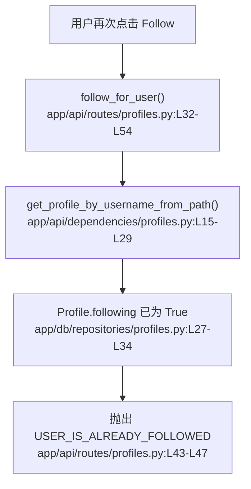

# 社交关系 · 定位

> 模拟问题：为什么前端重复发送关注请求会直接报 400？

## matched_modules

- 社交关系：重复关注的错误就是在 follow 路由里直接抛出的。
- 信息流：虽然问题发生在关注按钮，但它最终会影响 feed 是否继续刷新。

## call_chain



## exact_locations

```json
[
  {
    "file": "app/api/routes/profiles.py",
    "line": 43,
    "why_it_matters": "这里明确规定：如果 `profile.following` 已经是真，接口就返回 400。",
    "confidence": 0.99
  },
  {
    "file": "app/db/repositories/profiles.py",
    "line": 27,
    "why_it_matters": "资料对象在仓库层被注入了 `following` 状态，后续路由就是根据它决定是否报错。",
    "confidence": 0.94
  }
]
```

## diagnosis

相关模块是社交关系。当前逻辑把重复关注视为业务错误而不是幂等重试，因此前端如果因双击、重试或网络抖动发出第二次请求，就会在 `app/api/routes/profiles.py:L43-L47` 收到 400。
