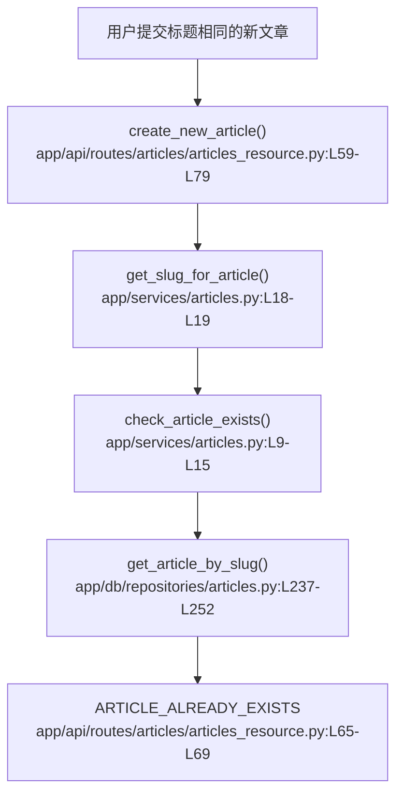

# 文章发布 · 定位

> 模拟问题：为什么同标题文章第二次发布会失败？

## matched_modules

- 文章发布：slug 的生成与冲突检查都发生在创建文章主链路里。
- 标签分类：虽然问题不在标签，但创建文章时会顺带触发标签写入。

## call_chain



## exact_locations

```json
[
  {
    "file": "app/services/articles.py",
    "line": 18,
    "why_it_matters": "标题会被直接 slugify，重复标题自然会得到同一个 slug。",
    "confidence": 0.98
  },
  {
    "file": "app/api/routes/articles/articles_resource.py",
    "line": 65,
    "why_it_matters": "命中已存在 slug 后，路由直接返回 400，没有任何自动补救逻辑。",
    "confidence": 0.99
  }
]
```

## diagnosis

相关模块是文章发布。问题根源不是数据库异常，而是当前产品规则只允许“标题转 slug 后唯一”。同标题会生成同一 slug，并在 `app/api/routes/articles/articles_resource.py:L64-L69` 被直接拒绝。
