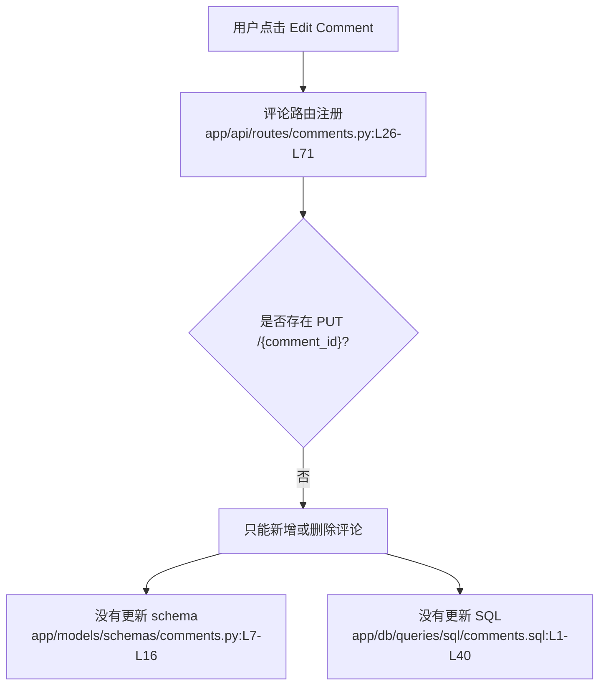

# 评论互动 · 定位

> 模拟问题：为什么用户不能编辑自己写的评论？

## matched_modules

- 评论互动：是否支持编辑评论，取决于这里有没有路由、schema 和更新 SQL。
- 文章发布：评论入口挂在文章详情页下面，但真正缺失的是评论子模块本身。

## call_chain



## exact_locations

```json
[
  {
    "file": "app/api/routes/comments.py",
    "line": 40,
    "why_it_matters": "评论路由只注册了 GET、POST、DELETE，没有任何 PUT/PATCH 编辑入口。",
    "confidence": 0.99
  },
  {
    "file": "app/models/schemas/comments.py",
    "line": 15,
    "why_it_matters": "schema 里只有 `CommentInCreate`，没有 `CommentInUpdate`。",
    "confidence": 0.98
  },
  {
    "file": "app/db/queries/sql/comments.sql",
    "line": 20,
    "why_it_matters": "SQL 文件只有新增和删除查询，没有评论更新语句。",
    "confidence": 0.96
  }
]
```

## diagnosis

这不是“某个条件没放开”，而是评论编辑功能压根没有实现。最值得先看的位置是 `app/api/routes/comments.py:L26-L71`，因为这里已经能确认没有编辑路由。
