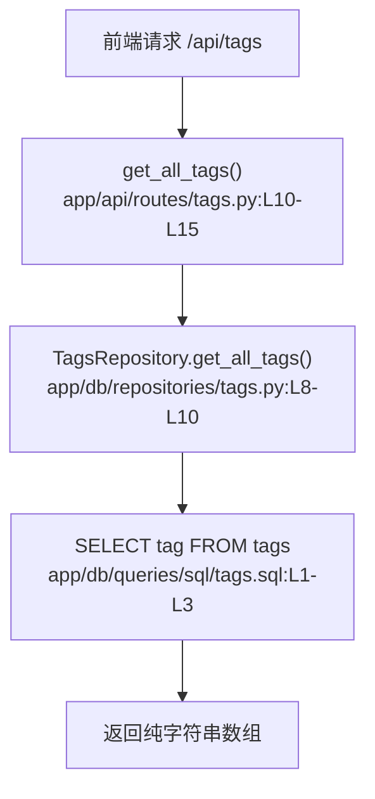

# 标签分类 · 定位

> 模拟问题：为什么标签接口只返回平铺列表，看不到热门程度？

## matched_modules

- 标签分类：返回结构与 SQL 都在这里定义。
- 文章发布：标签会被写入，但并没有维护任何单独的热度字段。

## call_chain



## exact_locations

```json
[
  {
    "file": "app/db/queries/sql/tags.sql",
    "line": 1,
    "why_it_matters": "SQL 只选了 `tag` 字段，没有统计文章数，也没有排序逻辑。",
    "confidence": 0.99
  },
  {
    "file": "app/models/schemas/tags.py",
    "line": 6,
    "why_it_matters": "响应模型把 `tags` 固定成了 `List[str]`，天然放不下热度字段。",
    "confidence": 0.98
  }
]
```

## diagnosis

相关模块是标签分类。当前接口只能回答“有哪些标签”，不能回答“哪些标签更热”，因为 SQL 和响应模型都只支持字符串数组。
