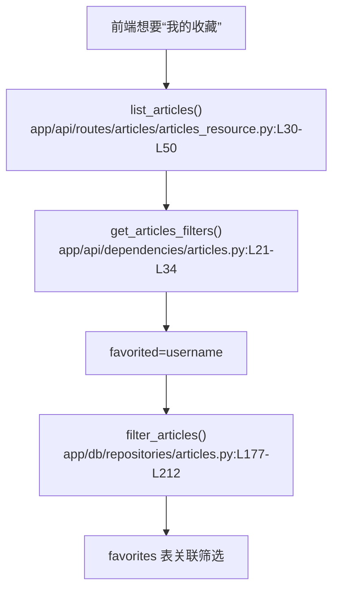

# 收藏系统 · 定位

> 模拟问题：想查当前用户收藏的文章，应该看哪里？

## matched_modules

- 收藏系统：真正的能力入口藏在文章列表筛选参数里。
- 文章发布：收藏结果最终仍通过文章列表接口返回文章对象。

## call_chain



## exact_locations

```json
[
  {
    "file": "app/api/dependencies/articles.py",
    "line": 24,
    "why_it_matters": "文章列表过滤器已经定义了 `favorited` 参数，说明收藏列表能力底层存在。",
    "confidence": 0.97
  },
  {
    "file": "app/db/repositories/articles.py",
    "line": 177,
    "why_it_matters": "仓库层在这里通过 `favorites` 表把收藏筛选真正落实成 SQL 条件。",
    "confidence": 0.99
  }
]
```

## diagnosis

相关模块是收藏系统，但它并没有一个对当前用户友好的显式接口。现成能力藏在 `GET /api/articles?favorited={username}` 这条列表链路里。
