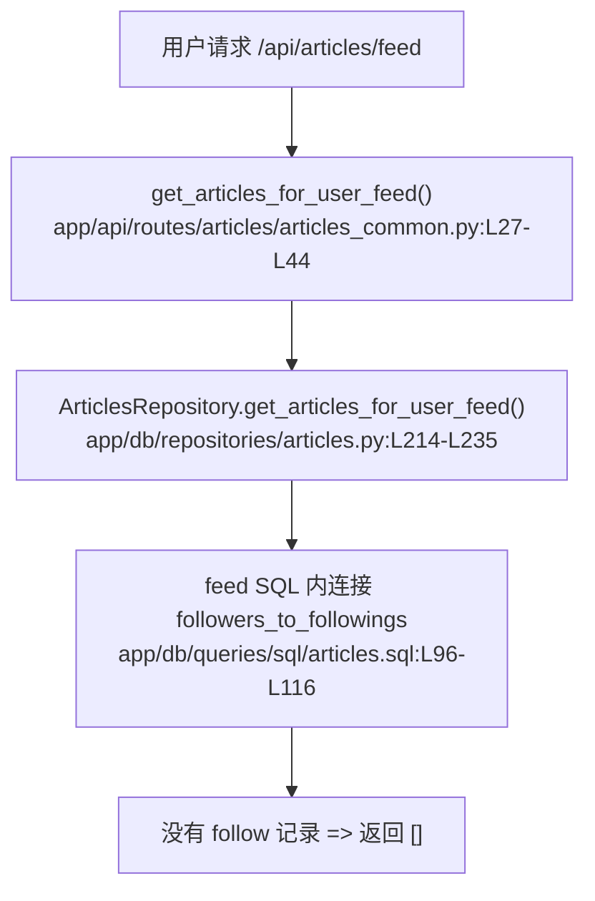

# 信息流 · 定位

> 模拟问题：新用户关注页为什么一直是空白？

## matched_modules

- 信息流：空白结果就发生在 feed 专用查询里。
- 社交关系：feed 是否有内容，完全取决于用户是否已经建立关注关系。

## call_chain



## exact_locations

```json
[
  {
    "file": "app/db/queries/sql/articles.sql",
    "line": 110,
    "why_it_matters": "feed 查询使用 `INNER JOIN followers_to_followings`，没有关注关系就不会返回任何文章。",
    "confidence": 0.99
  },
  {
    "file": "tests/test_api/test_routes/test_articles.py",
    "line": 246,
    "why_it_matters": "测试已经明确把“无关注返回空列表”定义成当前行为。",
    "confidence": 0.95
  }
]
```

## diagnosis

相关模块是信息流。当前实现不是“查不到推荐”，而是产品规则明确写成了“只看关注的人”。如果用户还没关注任何作者，feed SQL 就会自然返回空数组。
