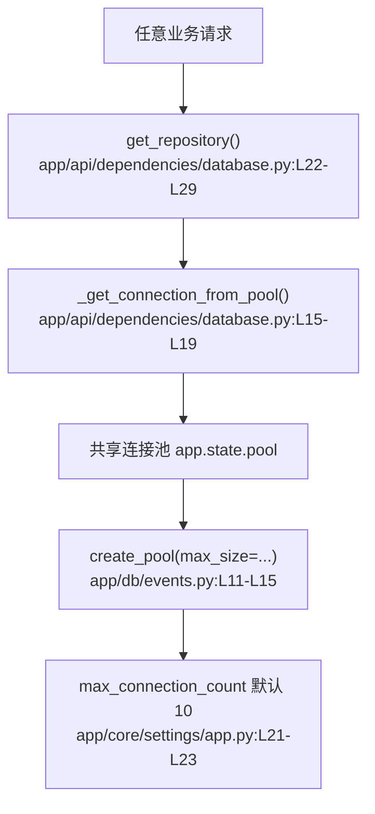

# 数据库连接与仓库层 · 定位

> 模拟问题：为什么并发一上来，全站接口都会一起变慢？

## matched_modules

- 数据库连接与仓库层：所有业务请求都必须先从同一个连接池借连接。
- 系统启动与配置：连接池上限由配置层决定。

## call_chain



## exact_locations

```json
[
  {
    "file": "app/api/dependencies/database.py",
    "line": 18,
    "why_it_matters": "所有请求都会在这里统一从连接池 `acquire()` 数据库连接。",
    "confidence": 0.97
  },
  {
    "file": "app/db/events.py",
    "line": 11,
    "why_it_matters": "共享池是在这里创建的，说明全站共用一个池。",
    "confidence": 0.96
  },
  {
    "file": "app/core/settings/app.py",
    "line": 22,
    "why_it_matters": "默认最大连接数只有 10，并发量一高就可能进入排队。",
    "confidence": 0.88
  }
]
```

## diagnosis

相关模块是数据库连接与仓库层。当前实现采用单个共享连接池承接全站请求，默认 `max_connection_count=10`。当并发请求都要访问数据库时，额外请求只能等待空闲连接归还，于是全站一起变慢。这里包含性能层面的推断，但证据链是充分的。
