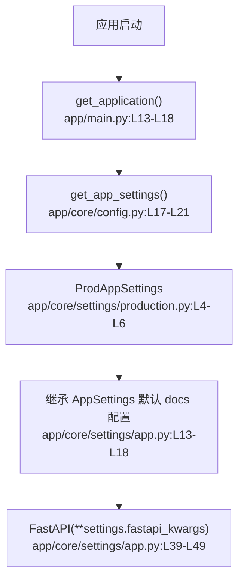

# 系统启动与配置 · 定位

> 模拟问题：为什么生产环境默认还暴露 /docs 和 /redoc？

## matched_modules

- 系统启动与配置：是否暴露 docs 由 settings 和 FastAPI 初始化参数决定。
- 数据库连接与仓库层：不是这次问题源头，但同样受启动装配层统一控制。

## call_chain



## exact_locations

```json
[
  {
    "file": "app/core/settings/app.py",
    "line": 14,
    "why_it_matters": "这里定义了 docs/openapi/redoc 的默认暴露路径。",
    "confidence": 0.99
  },
  {
    "file": "app/core/settings/production.py",
    "line": 4,
    "why_it_matters": "生产配置没有覆盖 docs 相关字段，所以会继承默认值。",
    "confidence": 0.98
  },
  {
    "file": "app/main.py",
    "line": 18,
    "why_it_matters": "FastAPI 实例就是用 `settings.fastapi_kwargs` 创建的，因此默认值会真正生效。",
    "confidence": 0.96
  }
]
```

## diagnosis

相关模块是系统启动与配置。问题不在路由总线，而在生产环境 settings 继承了应用默认值。只要 `ProdAppSettings` 不覆写 docs 相关字段，线上 `/docs`、`/redoc` 和 `/openapi.json` 就会继续开放。
