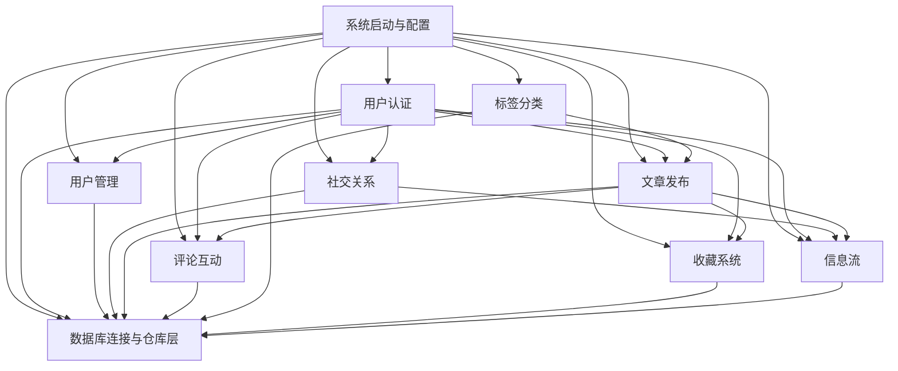

# 第1步｜蓝图

## project_summary

Conduit 是一个 Medium 风格的内容发布与社交平台。用户可以注册登录、发布文章、关注作者、收藏内容、发表评论，并通过标签与关注关系发现内容。

这个项目的主链路很明确：先完成账号登录，再围绕文章做创作与互动，最后由关注关系和标签把内容组织成可浏览的信息流。

## module_overview

```json
[
  {
    "name": "用户认证",
    "paths": [
      "app/api/routes/authentication.py",
      "app/api/dependencies/authentication.py",
      "app/services/authentication.py",
      "app/services/jwt.py",
      "app/db/repositories/users.py",
      "app/resources/strings.py"
    ],
    "responsibility": "负责账号注册、邮箱密码登录，以及后续受保护接口的身份校验。",
    "entry_points": [
      "POST /api/users",
      "POST /api/users/login",
      "所有带 Authorization 头的受保护接口"
    ],
    "depends_on": [
      "数据库连接与仓库层",
      "系统启动与配置"
    ],
    "used_by": [
      "用户管理",
      "社交关系",
      "文章发布",
      "评论互动",
      "收藏系统",
      "信息流"
    ],
    "pm_note": "注册和登录已经可用，但没有限制连续登录失败的次数（容易被暴力试密码），也没有强制登出的能力（令牌签发后只能等它过期）。"
  },
  {
    "name": "用户管理",
    "paths": [
      "app/api/routes/users.py",
      "app/models/schemas/users.py",
      "app/db/repositories/users.py"
    ],
    "responsibility": "负责读取当前用户资料，并更新用户名、邮箱、密码、简介和头像。",
    "entry_points": [
      "GET /api/user",
      "PUT /api/user"
    ],
    "depends_on": [
      "用户认证",
      "数据库连接与仓库层"
    ],
    "used_by": [
      "资料页",
      "文章作者展示",
      "评论作者展示"
    ],
    "pm_note": "资料修改可用，但缺少密码强度和邮箱真实性校验。"
  },
  {
    "name": "社交关系",
    "paths": [
      "app/api/routes/profiles.py",
      "app/api/dependencies/profiles.py",
      "app/db/repositories/profiles.py",
      "app/db/queries/sql/profiles.sql"
    ],
    "responsibility": "负责查看作者资料，并建立或取消用户之间的关注关系。",
    "entry_points": [
      "GET /api/profiles/{username}",
      "POST /api/profiles/{username}/follow",
      "DELETE /api/profiles/{username}/follow"
    ],
    "depends_on": [
      "用户认证",
      "数据库连接与仓库层"
    ],
    "used_by": [
      "文章详情页作者卡片",
      "信息流"
    ],
    "pm_note": "关注按钮不防重复点击——如果用户连点两次"关注"，第二次会直接报错而不是静默忽略。"
  },
  {
    "name": "文章发布",
    "paths": [
      "app/api/routes/articles/articles_resource.py",
      "app/api/dependencies/articles.py",
      "app/services/articles.py",
      "app/db/repositories/articles.py",
      "app/db/queries/sql/articles.sql"
    ],
    "responsibility": "负责文章创建、列表查询、详情读取、编辑和删除。",
    "entry_points": [
      "GET /api/articles",
      "POST /api/articles",
      "GET /api/articles/{slug}",
      "PUT /api/articles/{slug}",
      "DELETE /api/articles/{slug}"
    ],
    "depends_on": [
      "用户认证",
      "标签分类",
      "社交关系",
      "数据库连接与仓库层"
    ],
    "used_by": [
      "评论互动",
      "收藏系统",
      "信息流"
    ],
    "pm_note": "标题会被自动转成 URL 中的文章标识（例如"我的文章"→ my-article）；如果两篇文章标题相同，第二篇会发布失败，系统不会自动加编号。"
  },
  {
    "name": "评论互动",
    "paths": [
      "app/api/routes/comments.py",
      "app/api/dependencies/comments.py",
      "app/db/repositories/comments.py",
      "app/db/queries/sql/comments.sql"
    ],
    "responsibility": "负责按文章查看评论、发表评论，以及删除自己写的评论。",
    "entry_points": [
      "GET /api/articles/{slug}/comments",
      "POST /api/articles/{slug}/comments",
      "DELETE /api/articles/{slug}/comments/{comment_id}"
    ],
    "depends_on": [
      "用户认证",
      "文章发布",
      "数据库连接与仓库层"
    ],
    "used_by": [
      "文章详情页"
    ],
    "pm_note": "评论目前只有新增和删除，没有编辑、审核和回复树。"
  },
  {
    "name": "标签分类",
    "paths": [
      "app/api/routes/tags.py",
      "app/db/repositories/tags.py",
      "app/db/queries/sql/tags.sql"
    ],
    "responsibility": "负责返回全站标签列表，供发文与内容发现使用。",
    "entry_points": [
      "GET /api/tags"
    ],
    "depends_on": [
      "数据库连接与仓库层",
      "文章发布"
    ],
    "used_by": [
      "文章发布",
      "文章列表筛选"
    ],
    "pm_note": "接口只返回标签名，不返回热度和排序语义。"
  },
  {
    "name": "收藏系统",
    "paths": [
      "app/api/routes/articles/articles_common.py",
      "app/db/repositories/articles.py",
      "app/db/queries/sql/articles.sql"
    ],
    "responsibility": "负责收藏和取消收藏文章，并支撑按收藏关系筛选文章列表。",
    "entry_points": [
      "POST /api/articles/{slug}/favorite",
      "DELETE /api/articles/{slug}/favorite",
      "GET /api/articles?favorited={username}"
    ],
    "depends_on": [
      "用户认证",
      "文章发布",
      "数据库连接与仓库层"
    ],
    "used_by": [
      "文章详情页",
      "收藏页"
    ],
    "pm_note": "后端有收藏筛选能力，但缺少面向当前用户的显式入口。"
  },
  {
    "name": "信息流",
    "paths": [
      "app/api/routes/articles/articles_common.py",
      "app/db/repositories/articles.py",
      "app/db/queries/sql/articles.sql"
    ],
    "responsibility": "负责给已登录用户返回“我关注的人最近发了什么”的专属内容流。",
    "entry_points": [
      "GET /api/articles/feed"
    ],
    "depends_on": [
      "用户认证",
      "社交关系",
      "文章发布",
      "数据库连接与仓库层"
    ],
    "used_by": [
      "登录后首页"
    ],
    "pm_note": "当前信息流只展示已关注作者的内容——新注册用户如果没关注任何人，打开首页会是空白，没有默认推荐。"
  },
  {
    "name": "数据库连接与仓库层",
    "paths": [
      "app/api/dependencies/database.py",
      "app/db/events.py",
      "app/db/repositories/base.py",
      "app/db/queries/queries.py",
      "app/db/queries/tables.py",
      "app/db/queries/sql/*.sql",
      "tests/conftest.py"
    ],
    "responsibility": "负责创建数据库连接池、为每个请求分配连接，并承接各模块的数据库操作。",
    "entry_points": [
      "应用启动时创建连接池",
      "所有需要操作数据库的业务接口"
    ],
    "depends_on": [
      "系统启动与配置"
    ],
    "used_by": [
      "用户认证",
      "用户管理",
      "社交关系",
      "文章发布",
      "评论互动",
      "标签分类",
      "收藏系统",
      "信息流"
    ],
    "pm_note": "这是全站共享的基础设施，数据库同时处理请求的上限默认只有 10 个，高并发时会成为性能瓶颈。"
  },
  {
    "name": "系统启动与配置",
    "paths": [
      "app/main.py",
      "app/core/config.py",
      "app/core/events.py",
      "app/core/settings/app.py",
      "app/core/settings/base.py",
      "app/core/settings/development.py",
      "app/core/settings/production.py",
      "app/core/settings/test.py",
      "app/api/routes/api.py"
    ],
    "responsibility": "负责按环境装配 FastAPI 应用、挂载中间件与路由，并串起数据库生命周期。",
    "entry_points": [
      "app = get_application()",
      "APP_ENV 环境变量"
    ],
    "depends_on": [],
    "used_by": [
      "用户认证",
      "用户管理",
      "社交关系",
      "文章发布",
      "评论互动",
      "标签分类",
      "收藏系统",
      "信息流",
      "数据库连接与仓库层"
    ],
    "pm_note": "生产环境只切换了配置文件，没有关闭自动生成的 API 调试页面（任何人都能在浏览器里看到所有接口列表）。"
  }
]
```

## global_dependency_graph


