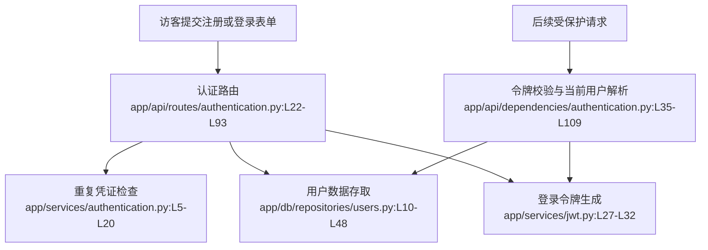

# 第2步｜看懂

## module_cards

```json
[
  {
    "name": "用户注册",
    "path": "app/api/routes/authentication.py",
    "what": "访客提交用户名、邮箱和密码后，系统创建账号并立即返回可登录状态。",
    "inputs": [
      "注册表单 `user.username / user.email / user.password`（来自注册页）",
      "系统密钥（来自应用配置）"
    ],
    "outputs": [
      "新创建的用户资料",
      "登录令牌（JWT）"
    ],
    "branches": [
      {
        "condition": "用户名已被占用",
        "result": "返回 400（请求有误）和 `USERNAME_TAKEN`，注册被拒绝。",
        "code_ref": "app/api/routes/authentication.py:L67-L71"
      },
      {
        "condition": "邮箱已被占用",
        "result": "返回 400（请求有误）和 `EMAIL_TAKEN`，注册被拒绝。",
        "code_ref": "app/api/routes/authentication.py:L73-L77"
      },
      {
        "condition": "用户名和邮箱都可用",
        "result": "创建用户、生成令牌、返回成功响应。",
        "code_ref": "app/api/routes/authentication.py:L79-L93"
      }
    ],
    "side_effects": [
      "会向 `users` 表写入一条新用户记录。证据：`app/db/repositories/users.py:L29-L48`。",
      "会生成一个 7 天有效的 JWT。证据：`app/services/jwt.py:L27-L32`。"
    ],
    "blast_radius": [
      "注册成功后，用户管理、文章发布、评论互动、收藏系统和信息流都依赖这条账号记录。",
      "注册错误文案变化会直接影响前端注册页和相关测试。"
    ],
    "key_code_refs": [
      "app/api/routes/authentication.py:L56-L93",
      "app/services/authentication.py:L5-L20",
      "app/db/repositories/users.py:L29-L48",
      "app/services/jwt.py:L27-L32"
    ],
    "pm_note": "注册成功后会直接进入登录态，但没有邮箱验证流程，也没有任何反垃圾账号策略。"
  },
  {
    "name": "用户登录",
    "path": "app/api/routes/authentication.py",
    "what": "已注册用户提交邮箱和密码后，系统验证身份并返回新的登录令牌。",
    "inputs": [
      "登录表单 `user.email / user.password`（来自登录页）",
      "系统密钥（来自应用配置）"
    ],
    "outputs": [
      "当前用户资料",
      "登录令牌（JWT）"
    ],
    "branches": [
      {
        "condition": "邮箱不存在",
        "result": "返回统一的登录失败提示。",
        "code_ref": "app/api/routes/authentication.py:L28-L36"
      },
      {
        "condition": "密码校验失败",
        "result": "返回统一的登录失败提示。",
        "code_ref": "app/api/routes/authentication.py:L38-L39"
      },
      {
        "condition": "邮箱和密码都正确",
        "result": "生成令牌并返回用户信息。",
        "code_ref": "app/api/routes/authentication.py:L41-L53"
      }
    ],
    "side_effects": [
      "不会写数据库，只会读取用户记录并生成令牌。证据：`app/db/repositories/users.py:L10-L15`、`app/services/jwt.py:L27-L32`。"
    ],
    "blast_radius": [
      "登录令牌是所有受保护功能的入口，失败会导致整条已登录主链路不可用。"
    ],
    "key_code_refs": [
      "app/api/routes/authentication.py:L22-L53",
      "app/db/repositories/users.py:L10-L15",
      "app/models/domain/users.py:L19-L24",
      "app/services/jwt.py:L27-L32"
    ],
    "pm_note": "错误提示刻意把“邮箱不存在”和“密码错误”合并，安全上合理，但用户体验偏冷。"
  },
  {
    "name": "重复凭证检查",
    "path": "app/services/authentication.py",
    "what": "注册或修改资料前，系统先检查用户名和邮箱是否已被其他账号占用。",
    "inputs": [
      "用户名（来自注册或资料修改流程）",
      "邮箱（来自注册或资料修改流程）"
    ],
    "outputs": [
      "是否已占用（是 / 否）"
    ],
    "branches": [
      {
        "condition": "数据库里查不到对应账号",
        "result": "返回 `False`，表示可以继续使用。",
        "code_ref": "app/services/authentication.py:L5-L18"
      },
      {
        "condition": "数据库里查到已有账号",
        "result": "返回 `True`，由上层路由决定具体报错。",
        "code_ref": "app/services/authentication.py:L11-L20"
      }
    ],
    "side_effects": [
      "只读数据库，不会改写任何数据。"
    ],
    "blast_radius": [
      "会同时影响注册和资料修改两条链路。"
    ],
    "key_code_refs": [
      "app/services/authentication.py:L5-L20",
      "app/db/repositories/users.py:L10-L27"
    ],
    "pm_note": "它只负责判断是否重复，不负责用户提示，所以文案友好度要在上层路由处理。"
  },
  {
    "name": "登录令牌生成",
    "path": "app/services/jwt.py",
    "what": "系统在注册或登录成功后，把用户名封装成一个 7 天有效的 JWT 令牌。",
    "inputs": [
      "用户名（来自当前用户对象）",
      "系统密钥（来自配置）"
    ],
    "outputs": [
      "JWT 字符串"
    ],
    "branches": [
      {
        "condition": "调用注册或登录成功路径",
        "result": "生成带过期时间和用户标识的登录令牌。",
        "code_ref": "app/services/jwt.py:L15-L32"
      }
    ],
    "side_effects": [
      "不写数据库，是纯计算逻辑。"
    ],
    "blast_radius": [
      "令牌格式、过期时间或签名算法变化会影响所有受保护接口。"
    ],
    "key_code_refs": [
      "app/services/jwt.py:L10-L40"
    ],
    "pm_note": "当前令牌有效期固定为 7 天，且没有主动吊销能力。"
  },
  {
    "name": "令牌校验与当前用户解析",
    "path": "app/api/dependencies/authentication.py",
    "what": "每个受保护接口都会先解析 Authorization 请求头，再从 token 中还原用户名并回库拿到当前用户。",
    "inputs": [
      "Authorization 请求头（浏览器自动附带的身份凭证）",
      "系统密钥（来自配置）"
    ],
    "outputs": [
      "当前用户对象",
      "校验失败时的 403 错误"
    ],
    "branches": [
      {
        "condition": "身份凭证缺失或格式不对",
        "result": "返回 403（没有权限），不允许进入业务路由。",
        "code_ref": "app/api/dependencies/authentication.py:L46-L63"
      },
      {
        "condition": "JWT 解码失败或用户不存在",
        "result": "返回 403 和 `MALFORMED_PAYLOAD`（令牌数据损坏）。",
        "code_ref": "app/api/dependencies/authentication.py:L78-L100"
      },
      {
        "condition": "JWT 合法且用户存在",
        "result": "把当前用户对象注入后续路由。",
        "code_ref": "app/api/dependencies/authentication.py:L83-L96"
      }
    ],
    "side_effects": [
      "每个受保护请求都会额外查一次用户表。"
    ],
    "blast_radius": [
      "会影响资料修改、关注、发文、评论、收藏和信息流。"
    ],
    "key_code_refs": [
      "app/api/dependencies/authentication.py:L21-L109",
      "app/services/jwt.py:L35-L40",
      "app/db/repositories/users.py:L17-L27"
    ],
    "pm_note": "这是整条已登录主链路的门禁层，只要这里出问题，所有登录后功能都会一起不可用。"
  }
]
```

## dependency_graph


