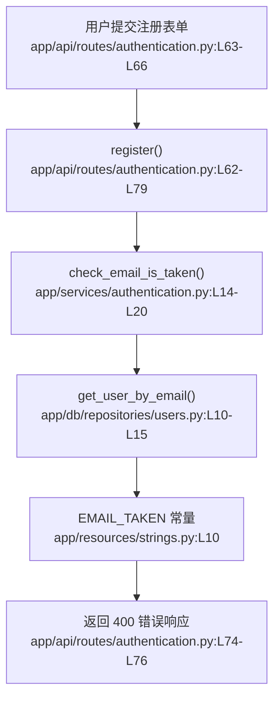

# 第3步｜定位

## matched_modules

- 用户注册：问题直接发生在注册接口返回邮箱重复错误的那一段逻辑，证据是 `app/api/routes/authentication.py:L73-L77`。
- 重复凭证检查：邮箱是否重复的判断来自 `check_email_is_taken()`，证据是 `app/services/authentication.py:L14-L20`。
- 文案资源：用户最终看到的具体报错文本定义在 `app/resources/strings.py:L8-L10`。

## call_chain



## exact_locations

```json
[
  {
    "file": "app/api/routes/authentication.py",
    "line": 73,
    "why_it_matters": "注册流程在这里命中邮箱重复检查，并直接把 `strings.EMAIL_TAKEN` 放进 400 错误响应。",
    “certainty”: “非常确定”
  },
  {
    “file”: “app/services/authentication.py”,
    “line”: 14,
    “why_it_matters”: “这里负责判断邮箱是否已存在，说明问题不是”没查出来”，而是”查出来之后怎么提示用户”。”,
    “certainty”: “很确定”
  },
  {
    “file”: “app/resources/strings.py”,
    “line”: 10,
    “why_it_matters”: “用户最终看到的英文提示 `user with this email already exists` 定义在这里，是不友好的直接来源。”,
    “certainty”: “非常确定”
  }
]
```

## diagnosis

相关模块是用户注册、重复凭证检查和文案资源。当前逻辑本身没有判错：注册接口会先校验邮箱是否重复，命中后正常返回 400（请求有误）。

真正让用户觉得“不友好”的原因不在数据库查询，也不在重复检查，而在于注册路由直接复用了 `app/resources/strings.py:L10` 里的英文技术文案。最应该先打开看的位置是 `app/api/routes/authentication.py:L73-L77` 和 `app/resources/strings.py:L10`。
