# Locate 验收示例

> **用户问题**: "调用 `scan_repo` 工具时，代码是怎么从 MCP 请求入口走到最终返回结果的？"

---

## 调用链路流程图

```mermaid
graph TD
    classDef entry fill:#d4edda,stroke:#28a745,color:#000
    classDef terminal fill:#f8d7da,stroke:#dc3545,color:#000
    classDef external fill:#cce5ff,stroke:#007bff,color:#000
    classDef decision fill:#fff3cd,stroke:#ffc107,color:#000

    A["MCP Client 发起 scan_repo 调用<br/><code>src/server.py:52</code>"]:::entry
    B["@mcp.tool() scan_repo 入口<br/>参数校验 + 日志记录<br/><code>src/server.py:62-63</code>"]
    C["_scan_repo() 主函数<br/><code>src/tools/scan_repo.py:332</code>"]

    D[("Step1: clone_repo()<br/>克隆/扫描仓库文件<br/><code>src/parsers/repo_cloner.py:162</code>")]:::external
    E{"克隆成功?<br/><code>src/tools/scan_repo.py:366-382</code>"}:::decision
    E_ERR["返回错误: 超时/失败<br/><code>src/tools/scan_repo.py:372-382</code>"]:::terminal

    F{"有代码文件?<br/><code>src/tools/scan_repo.py:393-401</code>"}:::decision
    F_ERR["返回错误: 未找到代码文件<br/><code>src/tools/scan_repo.py:395</code>"]:::terminal

    G[("Step2: parse_all()<br/>Tree-sitter AST 解析<br/><code>src/parsers/ast_parser.py:448</code>")]:::external
    H{"解析成功?<br/><code>src/tools/scan_repo.py:408-425</code>"}:::decision
    H_ERR["返回错误: 解析超时/失败<br/><code>src/tools/scan_repo.py:416-425</code>"]:::terminal

    I["Step3: group_modules()<br/>按目录结构分组模块<br/><code>src/parsers/module_grouper.py:81</code>"]
    J["Step4: DependencyGraph.build()<br/>构建 NetworkX 依赖图<br/><code>src/parsers/dependency_graph.py:44</code>"]
    K["set_module_groups()<br/>映射节点→模块<br/><code>src/parsers/dependency_graph.py:108</code>"]

    L["Step5: repo_cache.store()<br/>缓存上下文供后续工具复用<br/><code>src/tools/_repo_cache.py:22</code>"]
    M["generate_local_blueprint()<br/>生成蓝图数据(无 LLM)<br/><code>src/summarizer/engine.py:406</code>"]
    N["_build_project_overview()<br/>构建项目概览文本<br/><code>src/tools/scan_repo.py:81</code>"]

    O["Step6: _enhance_modules()<br/>增强模块卡片数据<br/><code>src/tools/scan_repo.py:208</code>"]
    P["_build_connections()<br/>提取模块间调用关系<br/><code>src/tools/scan_repo.py:298</code>"]
    Q["dep_graph.to_mermaid()<br/>生成 Mermaid 依赖图<br/><code>src/parsers/dependency_graph.py:159</code>"]

    R{"depth == detailed?<br/><code>src/tools/scan_repo.py:550</code>"}:::decision
    S["generate_local_chapter() 循环<br/>预生成所有模块卡片<br/><code>src/tools/scan_repo.py:557</code>"]

    T["组装最终 result dict<br/>status/modules/connections/mermaid/stats<br/><code>src/tools/scan_repo.py:578-605</code>"]:::terminal

    A -->|"routes to"| B
    B -->|"await _scan_repo()"| C
    C -->|"clone"| D
    D --> E
    E -->|"TimeoutError / Exception"| E_ERR
    E -->|"成功"| F
    F -->|"code_files 为空"| F_ERR
    F -->|"有代码文件"| G
    G --> H
    H -->|"TimeoutError / Exception"| H_ERR
    H -->|"成功"| I
    I -->|"modules"| J
    J -->|"node_map"| K
    K --> L
    L -->|"ctx cached"| M
    M -->|"blueprint"| N
    N --> O
    O --> P
    P --> Q
    Q --> R
    R -->|"是 detailed"| S
    S --> T
    R -->|"否 overview"| T
```

---

## 定位结论

| 维度 | 内容 |
|------|------|
| **所属模块** | MCP Server 核心 / 蓝图扫描能力（scan_repo tool） |
| **入口位置** | `src/server.py:52` — `@mcp.tool() scan_repo()` 装饰器注册的 MCP 工具入口 |
| **核心代码位置** | `src/tools/scan_repo.py:332-605` — `async def scan_repo()` 主函数，包含完整的 6 步流水线 |
| **调用链路径** | `server.scan_repo` → `tools.scan_repo._scan_repo` → `repo_cloner.clone_repo` → `ast_parser.parse_all` → `module_grouper.group_modules` → `DependencyGraph.build` → `engine.generate_local_blueprint` → `_build_project_overview` → `_enhance_modules` → `dep_graph.to_mermaid` → 组装返回 |
| **当前逻辑** | MCP Client 调用 `scan_repo` 工具后，`server.py` 的装饰器层做参数校验和日志记录，然后委托给 `tools/scan_repo.py` 的主函数。主函数按 6 步流水线执行：(1) 克隆仓库并过滤文件 (2) 用 Tree-sitter 做 AST 解析 (3) 按目录结构分组为业务模块 (4) 用 NetworkX 构建依赖图 (5) 生成蓝图概览+缓存上下文 (6) 增强模块数据并生成 Mermaid 图。每一步都有独立的超时控制和错误处理，失败时返回统一的 `_make_error()` 结构。如果 `depth=detailed`，还会额外循环生成每个模块的章节卡片。 |
| **问题原因 / 缺失点** | 1. **无增量扫描**：每次调用都完整执行 6 步，即使仓库未变化也要重新克隆+解析，`repo_cache`（`_repo_cache.py:22`）只缓存 SummaryContext 而不缓存整个扫描结果。 2. **Step5 串行生成 chapters**：`scan_repo.py:555-565` 中 `depth=detailed` 时用 `for` 循环逐个生成章节，未利用 `asyncio.gather` 并发。 3. **超时粒度粗**：每步独立超时但缺少全局总超时保护，6 步各自用满超时可能导致总耗时远超用户预期。 |
| **影响范围** | `read_chapter`、`diagnose`、`ask_about` 三个工具都依赖 `repo_cache` 中 scan_repo 缓存的 `SummaryContext`，如果 scan_repo 失败或超时，后续工具全部无法使用 |
| **建议修复方向** | 1. 增加基于 commit hash 的增量缓存，跳过未变化仓库的重新扫描。 2. `depth=detailed` 时用 `asyncio.gather` 并发生成 chapters。 3. 增加全局超时 `_TOTAL_TIMEOUT` 包裹整个 6 步流水线。 |
