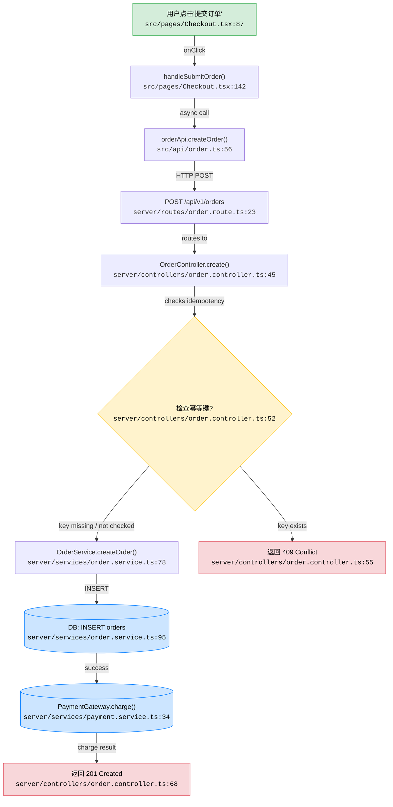

# Example Output — Locate Skill

Below is a complete example of the expected output when a user asks:

> "用户点击'提交订单'按钮后，为什么有时候会出现重复扣款？"

---

## Call Chain Flowchart

## 定位结论

| 维度 | 内容 |
|------|------|
| **所属模块** | 订单服务 / Order Service + 支付服务 / Payment Service |
| **入口位置** | `src/pages/Checkout.tsx:87` — 提交订单按钮的 onClick 事件 |
| **核心代码位置** | `server/controllers/order.controller.ts:52` — 幂等键检查逻辑 |
| **调用链路径** | Checkout.onClick → handleSubmitOrder → orderApi.createOrder → POST /api/v1/orders → OrderController.create → OrderService.createOrder → DB INSERT → PaymentGateway.charge |
| **当前逻辑** | 用户点击提交后，前端发起 POST 请求创建订单。Controller 层有一个幂等键（idempotency key）检查，但当前实现仅在 Redis 中缓存 key，TTL 仅 5 秒。如果用户在 5 秒后重复点击，或者 Redis 缓存失效，幂等检查将失效，导致同一笔订单被重复创建并重复扣款。 |
| **问题原因 / 缺失点** | 1. 前端缺少防重复点击（debounce/disable button）机制 — `Checkout.tsx:87` 的 onClick 未做任何防护。 2. 后端幂等键 TTL 过短（5秒）— `order.controller.ts:52` 的 Redis TTL 应与业务订单生命周期匹配。 3. 数据库层缺少唯一约束 — `order.service.ts:95` 的 INSERT 语句没有 `ON CONFLICT` 保护。 |
| **影响范围** | 支付模块（重复扣款）、库存模块（重复扣减）、用户钱包/余额、订单列表展示 |
| **建议修复方向** | 1. 前端：提交后立即 disable 按钮 + loading 状态。 2. 后端：将幂等键 TTL 延长至 24h，或改用数据库唯一索引做幂等。 3. DB：给 orders 表添加 `(user_id, idempotency_key)` 唯一约束。 |

---

## Notes on This Example

- Every Mermaid node has a `file:line` reference that was verified by reading the actual file
- The decision node (rhombus) shows a branch point in the logic
- External calls (DB, payment gateway) use stadium-shaped nodes
- The diagnosis table uses business language a product manager can understand
- Root cause analysis identifies multiple layers (frontend + backend + DB) rather than a single point of failure
