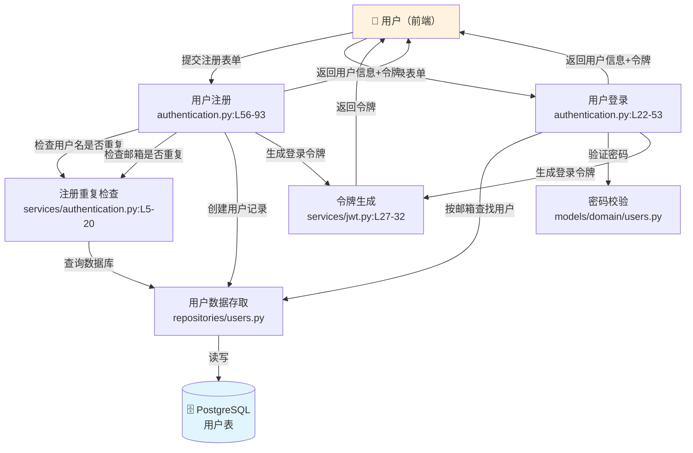

# CodeBook 原型验证：看懂（Understand）

> 输入：conduit 项目的用户认证相关源代码
> 输出：模块卡片 + 依赖关系图

---

## 模块卡片

### 卡片 1：用户注册

| 字段 | 内容 |
|------|------|
| **模块名** | 用户注册 |
| **路径** | `app/api/routes/authentication.py` |
| **做什么** | 新用户提交用户名、邮箱、密码，系统创建账号并返回登录凭证 |
| **输入** | 用户名 + 邮箱 + 密码（来自用户提交的注册表单） |
| **输出** | 用户信息 + 登录令牌（返回给前端，用户无需再次登录） |
| **分支逻辑** | |
| | **如果** 用户名已被占用 → 返回错误「用户名已存在」 — `authentication.py:L67-71` |
| | **如果** 邮箱已被注册 → 返回错误「邮箱已存在」 — `authentication.py:L73-77` |
| | **如果** 都没问题 → 创建用户 + 生成令牌 + 返回成功 — `authentication.py:L79-93` |
| **副作用** | 往数据库写入一条新用户记录（密码加密后存储）— `repositories/users.py:L29-48` |
| **影响范围** | 注册成功后，「用户登录」「个人资料」「发布文章」等所有需要身份验证的功能都依赖这里创建的账号 |
| **关键代码** | `authentication.py:L56-93`, `services/authentication.py:L5-20`, `repositories/users.py:L29-48` |
| **PM 备注** | ⚠️ 当前没有邮箱验证流程——用户填一个假邮箱也能注册成功。如果产品要求「真实邮箱」，需要加验证邮件。 |

---

### 卡片 2：用户登录

| 字段 | 内容 |
|------|------|
| **模块名** | 用户登录 |
| **路径** | `app/api/routes/authentication.py` |
| **做什么** | 已注册用户提交邮箱和密码，系统验证后返回登录凭证 |
| **输入** | 邮箱 + 密码（来自用户提交的登录表单） |
| **输出** | 用户信息 + 登录令牌（前端拿到令牌后，后续所有请求都带上它来证明身份） |
| **分支逻辑** | |
| | **如果** 邮箱不存在 → 返回错误「登录信息不正确」 — `authentication.py:L33-36` |
| | **如果** 密码不匹配 → 返回同样的错误「登录信息不正确」 — `authentication.py:L38-39` |
| | **如果** 验证通过 → 生成令牌 + 返回用户信息 — `authentication.py:L41-53` |
| **副作用** | 无（登录不修改数据库，只读取用户记录和验证密码） |
| **影响范围** | 登录返回的令牌是所有后续操作的身份证明——发文章、评论、关注都依赖它 |
| **关键代码** | `authentication.py:L22-53`, `repositories/users.py:L10-15`, `services/jwt.py:L27-32` |
| **PM 备注** | 登录失败时，无论是邮箱不存在还是密码错误，都返回同一条模糊错误信息——这是安全设计（防止探测哪些邮箱已注册），但如果产品想要更友好的提示，需要权衡安全性。 |

---

### 卡片 3：令牌生成

| 字段 | 内容 |
|------|------|
| **模块名** | 登录令牌生成 |
| **路径** | `app/services/jwt.py` |
| **做什么** | 用户登录或注册成功后，生成一个有效期 7 天的**令牌**（JWT——用户的临时通行证，过期后需重新登录） |
| **输入** | 用户名 + 系统密钥（来自登录/注册流程） |
| **输出** | 一串加密字符串（前端保存它，每次请求都带上） |
| **分支逻辑** | |
| | 无分支——只要输入正确就一定生成成功 — `jwt.py:L27-32` |
| **副作用** | 无（纯计算，不读写数据库） |
| **影响范围** | 生成的令牌被所有需要登录的操作使用（发文章、评论、关注、修改资料等） |
| **关键代码** | `jwt.py:L15-32` |
| **PM 备注** | ⚠️ 令牌有效期写死为 7 天（`jwt.py:L12`），且没有提前吊销机制——用户「退出登录」后令牌仍然有效直到过期。如果安全要求高，需要加令牌黑名单。 |

---

### 卡片 4：用户名/邮箱重复检查

| 字段 | 内容 |
|------|------|
| **模块名** | 注册重复检查 |
| **路径** | `app/services/authentication.py` |
| **做什么** | 注册时检查用户名或邮箱是否已被其他人使用 |
| **输入** | 用户名或邮箱（来自注册流程） |
| **输出** | 是/否（已被占用/可以使用） |
| **分支逻辑** | |
| | **如果** 在数据库中查到该用户名 → 返回「已被占用」 — `authentication.py:L5-11` |
| | **如果** 查不到 → 返回「可以使用」 — `authentication.py:L8-9` |
| **副作用** | 无（只读查询） |
| **影响范围** | 仅被「用户注册」流程调用 |
| **关键代码** | `services/authentication.py:L5-20` |
| **PM 备注** | 检查和实际创建之间有时间差——极端情况下两个用户同时注册同一个用户名，可能都通过检查但只有一个能创建成功（另一个会看到数据库报错）。 |

---

### 卡片 5：用户数据读写

| 字段 | 内容 |
|------|------|
| **模块名** | 用户数据存取 |
| **路径** | `app/db/repositories/users.py` |
| **做什么** | 所有和用户数据相关的数据库操作：按邮箱查用户、按用户名查用户、创建新用户、更新用户资料 |
| **输入** | 邮箱/用户名/用户资料（来自上层业务模块） |
| **输出** | 用户完整信息（返回给上层业务模块） |
| **分支逻辑** | |
| | **如果** 按邮箱/用户名查找但不存在 → 抛出「找不到」错误 — `users.py:L10-15`, `L17-27` |
| | **如果** 找到 → 返回用户信息 — `users.py:L12-13`, `L22-23` |
| | **如果** 更新时提供了新密码 → 重新加密密码 — `users.py:L66-67` |
| **副作用** | 创建和更新操作会写数据库（在数据库事务内执行，要么全成功要么全失败） |
| **影响范围** | 被「登录」「注册」「个人资料修改」三个模块直接调用 |
| **关键代码** | `repositories/users.py:L9-81` |
| **PM 备注** | 更新用户名时，如果新用户名已被占用，数据库会报错但代码没有提前检查——用户会看到一个不友好的系统错误而不是「用户名已存在」的明确提示。 |

---

## 全局依赖图

