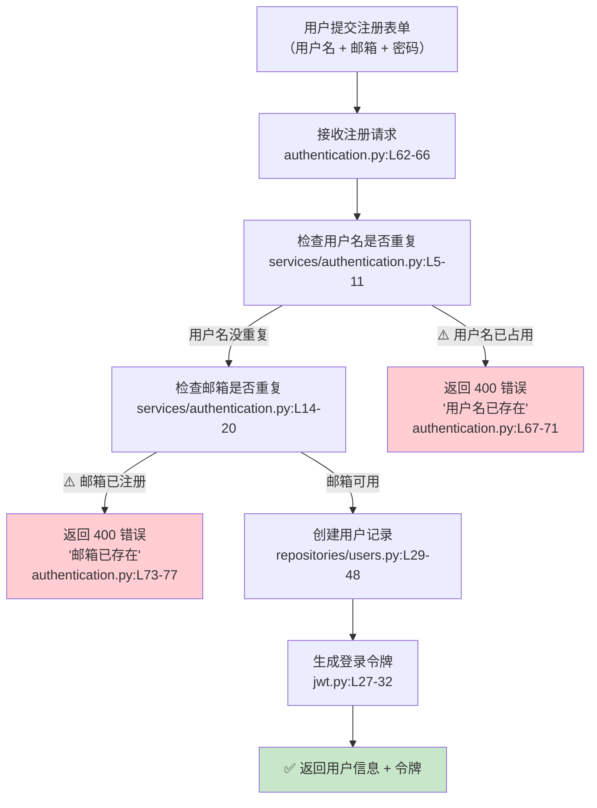

# CodeBook 原型验证：定位（Locate）

> 用户提问：「用户注册时填了一个已经存在的邮箱，为什么报错信息看起来像系统出了问题而不是明确告诉用户邮箱已存在？」

---

## 调用链路图

---

## 定位结论

| 字段 | 内容 |
|------|------|
| **相关模块** | 用户注册 → 注册重复检查 |
| **关键代码位置** | `authentication.py:L73-77` + `services/authentication.py:L14-20` |
| **原因分析** | 邮箱重复检查本身是正常工作的。当邮箱已被注册时，系统确实返回了 400 错误和 `EMAIL_TAKEN` 的提示文字。**问题不在后端逻辑，而在错误信息的表达方式**——具体的提示文案定义在 `resources/strings.py` 中。 |
| **当前逻辑** | 第 73 行：调用 `check_email_is_taken()` 检查邮箱 → 第 14-20 行：去数据库按邮箱查用户，查到了就返回 `True` → 第 74-77 行：抛出 400 错误，附带文案 `strings.EMAIL_TAKEN` |
| **需要确认** | 去看 `resources/strings.py` 中 `EMAIL_TAKEN` 的实际文案是什么——如果文案写的是技术性的错误描述（如 "entity already exists"），那用户看到就会觉得「系统出了问题」而不是「邮箱重复了」 |

---

## 追踪到的文案定义

查看 `resources/strings.py`，找到：

| 常量名 | 实际文案 | PM 评价 |
|--------|----------|---------|
| `EMAIL_TAKEN` | `"user with this email already exists"` | 英文技术语言，普通用户可能看不懂。建议改为：「该邮箱已注册，请直接登录或使用其他邮箱」 |
| `USERNAME_TAKEN` | `"user with this username already exists"` | 同上，建议改为：「该用户名已被使用，请换一个」 |
| `INCORRECT_LOGIN_INPUT` | `"incorrect email or password"` | 还算清楚，但建议加引导：「邮箱或密码不正确，请重试或找回密码」 |

---

## PM 行动清单

1. **确认错误文案需求**：当前所有报错都是英文技术语言，是否需要改为中文友好提示？
2. **确认前端展示方式**：后端返回的是纯文字，前端是直接展示还是映射成自定义 UI 提示？
3. **产品决策**：邮箱已注册时，是否引导用户「直接登录」而不是只报错？ 
